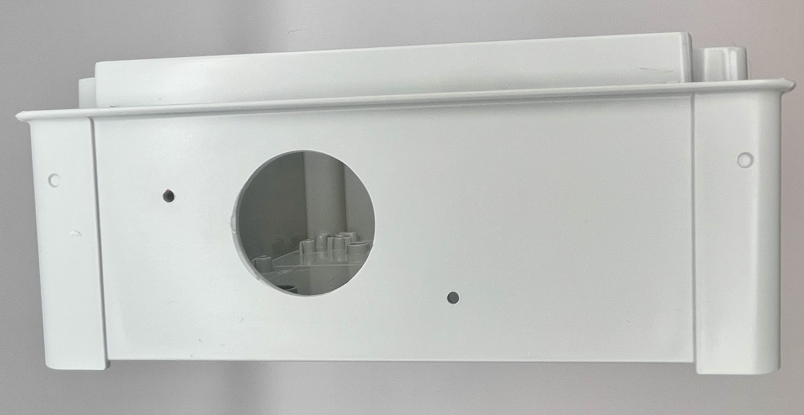
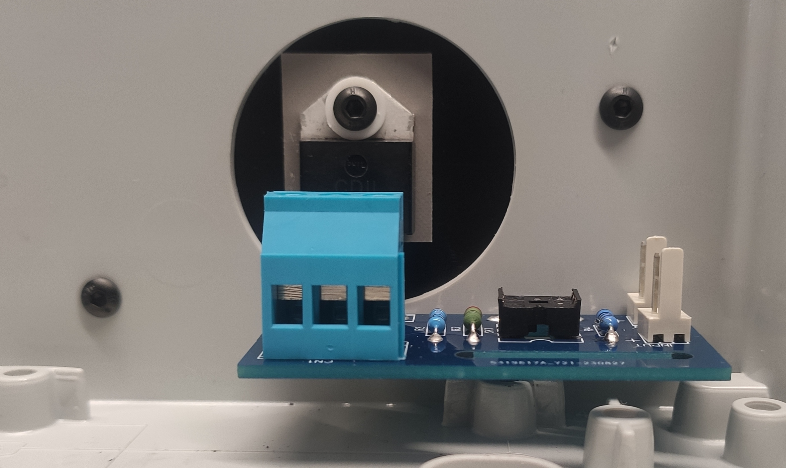
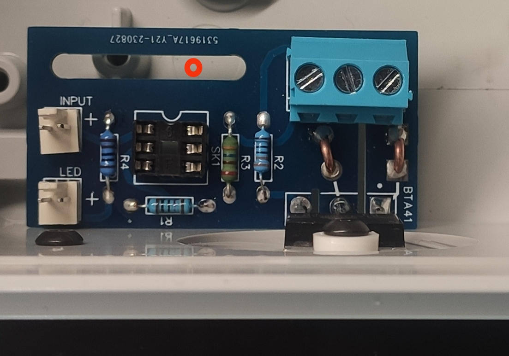
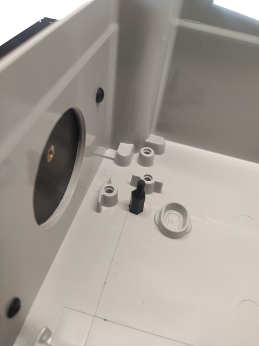
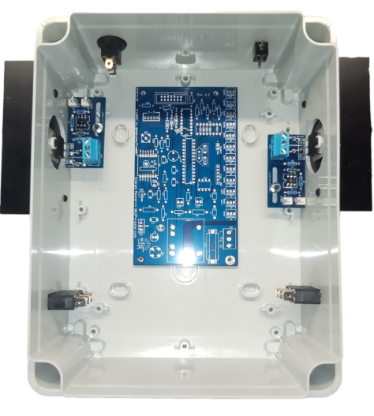

.. _percages:

========
Perçages
========

⏱️ **Temps estimé** : 1,5-2 heures (débutant), 45 min-1 heure (expérimenté)

🔧 **Niveau de difficulté** : Intermédiaire

⚠️ **Niveau de risque** : Moyen (perceuse, copeaux, bruit)

.. admonition:: 📋 Prérequis

   Avant de commencer ce chapitre :

   ☐ Chapitre :ref:`safety-overview` lu et compris (section perçage)

   ☐ Cartes assemblées et testées

   ☐ Outils de perçage à disposition (perceuse, mèches, gabarits)

   ☐ Temps disponible (1,5-2 heures pour débutant)

   ☐ Équipement de protection (lunettes, gants)

   ☐ Espace de travail propre avec étau ou serre-joints

Préparation du boîtier
-----------------------

Les boîtiers utilisés pour ce routeur sont de type industriel, fabriqués en ABS avec un retardateur de flamme.
Ils sont conformes aux normes de sécurité industrielles.

En fonction du nombre de sorties à contrôler, deux références peuvent être fournies :

* Thalassa **NSYTBS24198** : ce boîtier convient pour les configurations à **1** ou **2** sorties, pouvant être installées en mode portrait ou paysage.
* Thalassa **NSYTBS29248** : ce boîtier convient pour les configurations à **3** ou **4** sorties, à installer **uniquement en mode portrait**.

Il y a peu de contraintes à respecter, voici la liste :

* Le **presse-étoupe** doit être installé sur le **côté inférieur** pour protéger contre la poussière et les éventuels ruissellements.
* Les **dissipateurs** doivent être installés sur les côtés **verticaux**. C'est **impératif** pour assurer un bon refroidissement.

Pour le reste — témoins LED, etc. — ils peuvent être montés n'importe où, selon vos préférences !

Cependant, ce guide décrira l'implantation la plus classique.

Étapes à réaliser
~~~~~~~~~~~~~~~~~~

**Dissipateurs**
   - 2 trous de **3 mm** + 1 trou de **35 mm** par dissipateur
   - Voir `Perçage du boîtier`_ ci-dessous

**Étages de sortie triac**
   - 1 trou de **3 mm** par étage de sortie

**Carte-mère**
   - 4 trous de **3 mm**

**Presse-étoupe**
   - Trous de **20 mm** (quantité selon câblage)

**Prises jack** (CT de mesure)
   - Trous de **8 mm**
   - 1 prise pour monophasé, 3 prises pour triphasé

**Témoins LED et afficheur 4 Digits** (*Monophasé uniquement*)
   - Trous de **8 mm**

**Bouton marche/arrêt** (*Monophasé uniquement*)
   - 1 trou de **20 mm**

**Bouton reset** (*Triphasé uniquement*)
   - 1 trou de **13 mm**

Outils nécessaires
~~~~~~~~~~~~~~~~~~~

.. include:: ../common/outils.inc.rst

Dissipateur
-----------

Le rôle du dissipateur est d'évacuer la chaleur produite par le courant traversant le triac.

Il s'agit d'une pièce en aluminium dotée d'ailettes, ce qui augmente la surface d'échange avec l'air ambiant.

.. note::
   **À retenir**
   Lors de l'installation finale du boîtier, il est **impératif** de positionner les ailettes en vertical. En effet, l'air chaud étant plus léger que l'air froid, un flux d'air ascendant se crée naturellement, l'air frais étant *aspiré* en bas et l'air chaud expulsé en haut.

Étant donné la taille du dissipateur, il est recommandé de ne pas connecter plus de 3 kW à chaque sortie.

.. _percage-du-dissipateur:

Perçage du dissipateur
~~~~~~~~~~~~~~~~~~~~~~

Chaque dissipateur doit être percé de trois trous : deux pour la fixation sur le boîtier et un au milieu pour le triac.

.. drawio-figure:: ../drawio/dissipateur.drawio
   :alt: Gabarit de perçage
   :align: center
   :page-index: 0

   Gabarit de perçage

:download:`Gabarit de perçage <../pdf/dissipateur.pdf>`

Comme indiqué, le perçage sera en 3 mm de diamètre. Pour le trou du milieu, percez d'abord entièrement en 3 mm, puis en 4 mm sur une profondeur de 2 mm.

Ce gabarit devra être imprimé en taille réelle.
Assurez-vous que les dimensions sont correctes une fois imprimées.

Le gabarit sera placé sur la face pleine du dissipateur.

L'utilisation d'une perceuse à colonne est recommandée.

.. figure:: ../img/Gabarit-dissipateur.jpg
   :alt: Positionnement du gabarit sur le dissipateur
   :align: center
   :scale: 25%

   Positionnement du gabarit sur le dissipateur

.. figure:: ../img/Dissipateur-perce.jpg
   :alt: Dissipateur percé
   :align: center
   :scale: 25%

   Dissipateur percé

.. _percage-du-boitier:

Perçage du boîtier
~~~~~~~~~~~~~~~~~~

Chaque dissipateur sera monté sur les côtés **verticaux** du boîtier. Selon le nombre de sorties, la taille du boîtier variera.

Selon le cas, il sera possible d'installer le boîtier en mode paysage ou en mode portrait. Chacun fait en fonction des contraintes, en veillant à toujours faire en sorte que les dissipateurs soient dans le sens **vertical**.

Le boîtier doit être percé de trois trous : deux pour la fixation du dissipateur sur le boîtier et un au milieu pour laisser de la place au triac.

.. drawio-figure:: ../drawio/dissipateur.drawio
   :alt: Gabarit de perçage du boîtier
   :align: center
   :page-index: 1

   Gabarit de perçage du boîtier

:download:`Gabarit de perçage <../pdf/dissipateur.pdf>`

Comme indiqué, le perçage sera en 3 mm de diamètre. Il est possible de percer en 3,5 mm pour avoir une petite marge en cas d'imprécision du perçage.

Pour le trou du milieu, l'idéal est d'utiliser une fraise ou un foret à étage.

.. figure:: ../img/fraise.jpg
   :alt: Exemple de fraise
   :align: center
   :scale: 25%

   Exemple de fraise

Sachant que le trou sera caché par le dissipateur, il n'est pas nécessaire que le trou soit parfaitement propre ou parfaitement circulaire.

Ce gabarit doit être imprimé à taille réelle. Assurez-vous que les dimensions sont correctes une fois imprimées.

Le gabarit sera placé sur la face externe du boîtier, le bas du gabarit le long du bord inférieur du boîtier.
Bien placé, le dissipateur sera en contact avec la collerette périphérique du boîtier.

.. figure:: ../img/Gabarit-dissipateur-boitier.jpg
   :alt: Positionnement du gabarit sur le boîtier
   :align: center
   :scale: 25%

   Positionnement du gabarit sur le boîtier

L'utilisation d'une perceuse à colonne est recommandée.

.. figure:: ../img/Boitier-marque.jpg
   :alt: Boîtier marqué
   :align: center
   :scale: 25%

   Boîtier marqué

   Boîtier percé

Perçage pour chaque étage de sortie :term:`triac`
---------------------------------------------------

Le :term:`triac` de la carte de sortie doit être plaqué intégralement et fixé sur le dissipateur en façade du boîtier.
L'étage de sortie doit aussi être fixé au fond du boîtier à la bonne hauteur pour être en accord avec le point de fixation du triac.

Pour ce faire :

1. Fixer le dissipateur sur le boîtier préalablement préparé
2. Fixer l'étage de sortie sur le dissipateur par l'intermédiaire du triac

Vu du dessus, il est possible de pointer le futur perçage à l'endroit le plus adéquat dans le trou oblong.

   Fixation dissipateur / étage de sortie

   Pointage

Pour percer, l'étage de sortie doit être retiré.
Le perçage doit être effectué avec un foret de **3 mm** de diamètre.

Pour ajuster la hauteur de la carte de sortie, un plot en plastique de **10 mm** de haut est installé à l'aide d'une vis **M3** en plastique.

   Plot

.. admonition:: ✅ Point de Contrôle — Perçage Étages de Sortie

   Avant de continuer, vérifiez :

   | ☐ **Dissipateurs fixés solidement** sur les côtés verticaux du boîtier
   | ☐ **Triacs montés** sur les dissipateurs avec pâte thermique
   | ☐ **Tous les trous de montage percés à 3 mm** de diamètre
   | ☐ **Plots 10 mm installés** avec vis M3 plastique
   | ☐ **Hauteur des cartes de sortie correcte** (alignement avec dissipateur)
   | ☐ **Cartes de sortie se fixent solidement** sans forcer
   | ☐ **Pas d'interférence** avec les dissipateurs ou autres composants

.. _percage-carte-mere:

Perçage pour la carte-mère
--------------------------

Une fois les étages de sortie correctement positionnés, vous pouvez placer la carte-mère de manière à ne pas entraver les futurs branchements et autres équipements.
En utilisant la même méthode, vous pouvez marquer et percer le boîtier aux dimensions appropriées.

   Pointage carte mère

Pour éviter qu'elle ne repose sur les points de fixation au fond du boîtier, un plot en plastique de **10 mm** de hauteur est installé à l'aide d'une vis **M3** sur tous les trous de montage percés, de la même manière que pour l'étage de sortie.

.. admonition:: ✅ Point de Contrôle — Perçage Carte-Mère

   Avant de passer au câblage, vérifiez :

   | ☐ **Tous les trous percés** aux dimensions appropriées
   | ☐ **Plots 10 mm installés** avec vis M3 plastique
   | ☐ Carte-mère positionnée sans entraver les branchements
   | ☐ Carte-mère ne touche pas les points de fixation du boîtier
   | ☐ Espace suffisant pour le câblage autour de la carte-mère

.. |br| raw:: html

   
