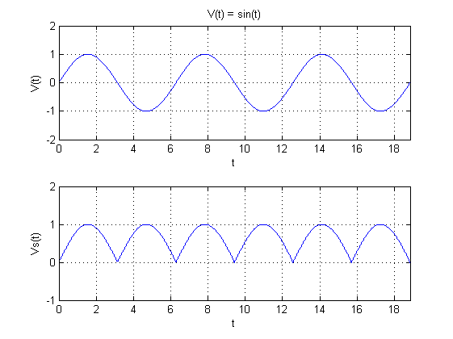

.. _carte-mere-mono-rst:

Carte-mère monophasée
=====================

Plusieurs versions du :term:`PCB` peuvent exister.

Bien qu'elles fonctionnent toutes de la même manière, chaque nouvelle version offre plus de flexibilité que la précédente ainsi que quelques améliorations mineures, essentiellement des aspects pratiques (facilité d'accès des entrées/sorties de l’Arduino, …).

Inventaire complet des composants
---------------------------------

Ci-dessous, vous découvrirez la liste complète des composants qui pourraient être inclus dans votre kit.
Il est important de noter que votre kit ne contiendra pas tous ces composants simultanément, car il est techniquement impossible d'intégrer toutes les fonctionnalités disponibles dans un seul et même kit.
Seulement certaines combinaisons de composants sont réalisables.

Résistances
~~~~~~~~~~~

Ces composants n'ont pas de sens et sont très peu sensibles à l'électricité statique.

Les valeurs des résistances sont indiquées sur le schéma de circuit et sont répétées ici pour plus de commodité :
(veuillez lire les notes ci-dessous qui concernent ces valeurs de composants)

- **R1** = **47 kΩ**. Cela fournit le *:term:`pull-up`* pour la ligne de réinitialisation du processeur.
- **R2** = **10 kΩ**. Avec R3, cela fournit une tension de référence pour les capteurs d'entrée.
- **R3** = **10 kΩ**. Avec R2, cela fournit une tension de référence pour les capteurs d'entrée.
- **R4** = **100 Ω** ou **180 Ω**. **R4** et **R5** réduisent la taille du signal :term:`AC` du transformateur.
- **R5** = **1 kΩ**. **R4** et **R5** réduisent la taille du signal :term:`AC` du transformateur.
- **R6** = **120 Ω** ou **150 Ω**. Il s'agit de la résistance de charge (ou *:term:`burden`*) du capteur de courant *grille*, qui utilise :term:`CT`\1.
- **R7** = **120 Ω** ou **150 Ω**. Il s'agit de la résistance de charge pour le capteur de courant *détourné*, qui utilise :term:`CT`\2.
- **R8** = **1 kΩ**. Cette résistance est en série avec :term:`CT`\1 pour protéger le processeur des signaux importants.

Diodes
~~~~~~

Celles-ci offrent un certain degré de protection au processeur lorsque des courants élevés traversent les :term:`CT`\s.

.. attention::
   Ces composants sont polarisés.

   Ils doivent être placés selon le repérage sur la couche sérigraphiée.

Supports :term:`DIL` pour circuits intégrés
~~~~~~~~~~~~~~~~~~~~~~~~~~~~~~~~~~~~~~~~~~~

Les deux supports repérés **IC1** et **IC2** seront toujours présents. Ce sont ceux utilisés pour placer le microcontrôleur Atmega328P, le coeur du système, ainsi que l'amplificateur opérationnel qui permet d'obtenir des tensions stables nécessaires au fonctionnement du routeur.

Si l'option *pin-saving hardware* est utilisée, deux autres circuits intégrés seront nécessaires (**IC3** et **IC4**).
Cette distinction est expliquée plus en détail ultérieurement.

.. attention::
   Chaque support a une encoche à une extrémité. Celle-ci doit être alignée avec la marque correspondante sur la couche sérigraphiée, comme indiqué ici.

Avec le support convenablement soutenu par le bas (on peut aussi utiliser un morceau d'adhésif), les deux broches situées dans les coins opposés peuvent être soudées en place.
Si un réalignement du composant est nécessaire, il doit être effectué **avant** que les broches restantes ne soient fixées.

L'affichage à 4 chiffres peut être contrôlé de deux manières.
Si le module RF n'est pas requis et que ces broches IO ne sont pas nécessaires à d'autres fins, un ensemble complet de broches IO sur le processeur peut être dédié au pilotage de l'affichage.
Cette configuration nécessite l'ajout de quatorze ponts comme indiqué dans la couche sérigraphiée. La planche de la photo suivante est assemblée de cette manière :

Les 14 ponts sont représentés ici :
- 5 ponts à **IC3**
- 1 pont à **IC4**
- 5 ponts en **J1-5**
- 1 pont en **R24**
- 1 pont en **R25**
- 1 pont en **R26**

Si le module RF est requis (ou si l'une de ces broches IO est nécessaire à toute autre fin), l'écran peut être utilisé à l'aide de l'option *pin-saving hardware*.
Pour cette disposition, les supports pour **IC3** et **IC4** doivent être installés comme indiqué ci-dessous.

Ici, l'un des :term:`PCB` d'origine est présenté avec uniquement ces supports en place, pour **IC3** et **IC4**.

.. note::
   Lorsque l'option *pin-saving hardware* est utilisée, aucune liaison filaire ne doit être installée au niveau du connecteur **J1-J5**.

Étant donné que cette carte est assemblée avec l'option *pin-saving hardware*, des supports d'embase ont été installés aux quatre emplacements de circuits intégrés.

.. note::
   Les deux circuits intégrés qui composent l'option *pin-saving hardware* ont tous deux été initialement spécifiés à partir de la série **74HC**.

   Malheureusement, le **74HC4543** pour **IC3** n'est plus disponible sous forme DIL. Lorsqu'elle fonctionne à **3,3 V**, le composant CMOS de remplacement n'est pas en mesure de fonctionner correctement.

   Ainsi, chaque fois que l'option *pin-saving hardware* doit être utilisée, le processeur doit fonctionner à **5 V**.

Condensateurs céramiques et oscillateur
~~~~~~~~~~~~~~~~~~~~~~~~~~~~~~~~~~~~~~~

Ces composants ne sont pas polarisés.

Les condensateurs céramiques sont en général orange, et ont la forme d'une goutte d'eau, par opposition aux condensateurs électrolytiques polarisés de forme cylindriques et bleus ou noirs.

.. note::
   Parmi le jeu de condensateurs céramiques, deux d'entre eux sont plus petits que les autres.

   Il s'agit des deux condensateurs associés à l'oscillateur, leur valeur est de **22 pF** et sont référencés **C6** et **C7**.

   **C3**, **C4** et **C5** sont des condensateurs céramiques de **100 nF**, généralement marqués *104*.

.. note::
   L'oscillateur ainsi que ses deux condensateurs associés peuvent être soudés légèrement au-dessus du :term:`PCB`.

   Ce n'est pas nécessaire pour le bon fonctionnement.

   Pour ce faire, on pourra utiliser une allumette le temps d'effectuer la soudure.

Pont redresseur ou pont de diodes
~~~~~~~~~~~~~~~~~~~~~~~~~~~~~~~~~

Le rôle de ce composant est de redresser le courant alternatif fourni par le transformateur.
C'est la première étape nécessaire pour obtenir une alimentation en courant continu.

Sur la figure ci-après, la courbe du haut correspond à la tension fournie par le transformateur.
La courbe du bas est la tension fournie par le redresseur.

   Redressement double alternance

.. attention::
   Ce composant est polarisé.

   Il faudra bien veiller à faire correspondre le marquage sur le boîtier avec celui de la couche sérigraphiée.

La broche la plus longue correspond au **+**.

Comme pour l'oscillateur, il est courant de le souder légèrement au-dessus du :term:`PCB`.

Connecteurs SIL/Molex/Embase 14 broches
~~~~~~~~~~~~~~~~~~~~~~~~~~~~~~~~~~~~~~~

Les connecteurs Molex ainsi que l'embase 14 broches sont *polarisés*, ils possèdent un détrompeur.
Physiquement, ce sont des composants passifs, mais étant donné qu'ils serviront à la connexion d'autres composants ou modules polarisés, il est important de les souder selon le marquage sur la couche sérigraphiée.

Les connecteurs SIL, ou *pin header*, peuvent être soudés dans n'importe quel sens.

Condensateurs électrolytiques
~~~~~~~~~~~~~~~~~~~~~~~~~~~~~

Les deux condensateurs électrolytiques, **C1** et **C2**, sont polarisés et doivent donc être installés dans le bon sens.
La broche **-ve** est indiquée par une bande proéminente, en général blanche, sur toute la longueur du composant.

L'autre broche est la **+ve**, qui doit aller dans le trou marqué **+** sur la couche sérigraphiée.

.. attention::
   Bien qu’ils se ressemblent assez, il est important que ces deux condensateurs soient installés aux bons endroits.

   Le plus grand condensateur (**C1** = **100 μF**) est le plus proche du pont redresseur.
   Le plus petit (**C2** = **10 μF**) est le plus proche de **IC2**.

   Si ces deux composants sont inversés, les symptômes qui en résultent peuvent être difficiles à diagnostiquer.

Connecteurs secteur et porte-fusible
~~~~~~~~~~~~~~~~~~~~~~~~~~~~~~~~~~~~

Le connecteur secteur repéré **TB1** recevra l'alimentation électrique 230 V.
Cette alimentation permettra à la fois d'alimenter la carte-mère, mais aussi la prise de mesure de la tension du secteur.

Le porte-fusible repéré **FS1** peuvent maintenant être installés.
Il protégera le système en cas de défaillance du transformateur.

En raison des pistes du plan masse, la broche centrale de **TB1** nécessitera plus de chaleur que les autres broches.
Ces borniers doivent être orientés correctement pour permettre un accès facile au câblage.
Il est très facile de se tromper de sens !

Si cela se produit, le plastique peut être soigneusement coupé avec un couteau et chaque broche extraite séparément.

Le porte-fusible, accompagné de son fusible de **100 mA**, est simple à mettre en place.

Régulateur·s de tension
~~~~~~~~~~~~~~~~~~~~~~~

Le régulateur de tension **VR1** doit être positionné de manière à ce que son ailette métallique soit éloignée du transformateur, comme indiqué sur la sérigraphie.
En fonction de l'application, le **VR1** sera une version **3,3 V** ou **5 V**.
La version **5 V** est nécessaire chaque fois que l'option *pin-saving hardware* est utilisée.

La soudure des broches du **VR1** nécessitera probablement une température plus élevée.
Pour réduire la quantité de métal à chauffer, il est possible de couper préalablement ces broches à la longueur requise.

Le régulateur de tension **VR2** se présente sous la forme habituelle d'un transistor, soit un cylindre noir avec un méplat.

Varistance
~~~~~~~~~~

Ce composant non polarisé et repéré **RV1**, est une protection contre les surtensions qui pourraient venir du réseau électrique.

Transformateur
~~~~~~~~~~~~~~

Le dernier composant à installer est le transformateur. Il s'agit d'un transformateur double **6 V** comme indiqué sur la couche sérigraphiée.
Un transformateur de **6 V** peut prendre en charge un régulateur de tension de **3,3 V** ou de **5 V**.

.. important::
   Lors de l'installation de ce composant, assurez-vous qu'il n'y ait aucun espace entre la base du transformateur et la carte de circuit imprimé :term:`PCB`.

Le module radiofréquence ou module RF
~~~~~~~~~~~~~~~~~~~~~~~~~~~~~~~~~~~~~

Ce module de type RFM12B ou RFM69 existe sous plusieurs fréquences. Il permettra de faire communiquer deux cartes-mères distantes via radio.

Lorsque ce module est livré, il sera accompagné d'un socle à souder (repéré **SMA**) pour l'antenne, ainsi qu'une antenne.

.. caution::
   Ce module est très sensible à l'électricité statique.

   Il faudra veiller à relier son corps à la masse (prise de terre) et ne pas porter de vêtements synthétiques lors de l'opération d'assemblage.

Synthèse
--------

Voici l'inventaire spécifique à chaque configuration :
- **:ref:`A <carte-mere-mono-A>`** : 1 à 12 sorties triac et/ou relais, **sans afficheur**, **sans module RF**
- **:ref:`B <carte-mere-mono-B>`** : 1 à 2 sorties triac et/ou relais, **avec afficheur**, **sans module RF**
- **:ref:`C <carte-mere-mono-C>`** : 3 à 7 sorties triac et/ou relais, **avec afficheur**, **sans module RF**
- **:ref:`D <carte-mere-mono-D>`** : 0 à 2 sorties triac et/ou relais, **avec afficheur**, **avec module RF** (émetteur ou récepteur)
- **:ref:`E <carte-mere-mono-E>`** : 0 à 7 sorties triac et/ou relais, **sans afficheur**, **avec module RF** (émetteur ou récepteur)

+---------------+---+---+---+---+---+
|               | A | B | C | D | E |
+===============+===+===+===+===+===+
| **R11-R18**   | - | X | X | X | - |
+---------------+---+---+---+---+---+
| **CN1/Nappe** | - | X | X | X | - |
+---------------+---+---+---+---+---+
| **IC3-IC4**   | - | - | X | X | - |
+---------------+---+---+---+---+---+
| **VR2**       | - | - | - | X | X |
+---------------+---+---+---+---+---+
| **C8-C9**     | - | - | - | X | X |
+---------------+---+---+---+---+---+
| **RF**        | - | - | - | X | X |
+---------------+---+---+---+---+---+
| **R21-R26**   | - | - | - | X | - |
+---------------+---+---+---+---+---+

Soudure
-------

.. hint::
   Après chaque étape, il conviendra de vérifier les soudures effectuées (l'utilisation d'une loupe facilitera la vérification).

   Ensuite, on pourra couper **à ras** toutes les pattes qui dépassent avec une petite pince coupante afin de faire place nette pour l'étape suivante.

.. toctree::
    :maxdepth: 1

    carte-mere-mono-A
    carte-mere-mono-B
    carte-mere-mono-C
    carte-mere-mono-D
    carte-mere-mono-E
