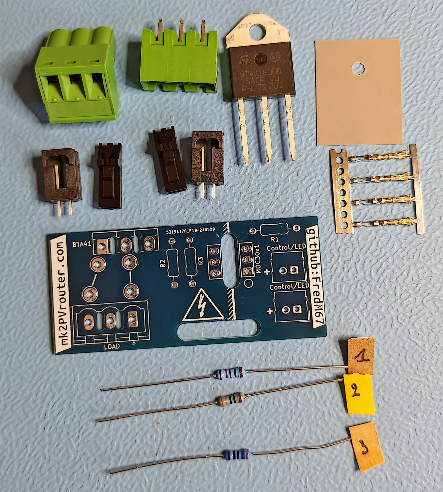
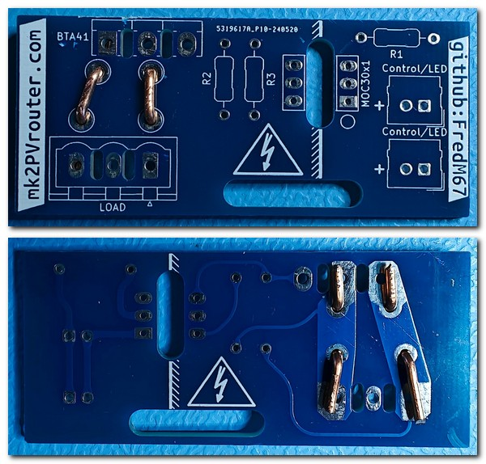
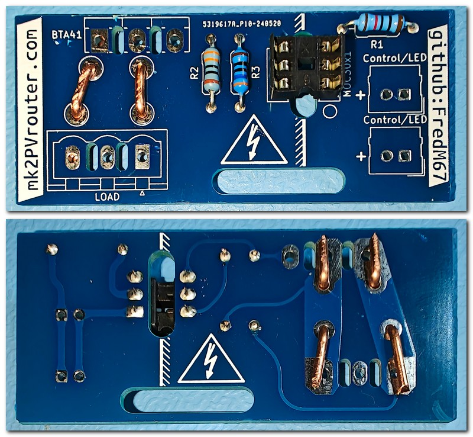
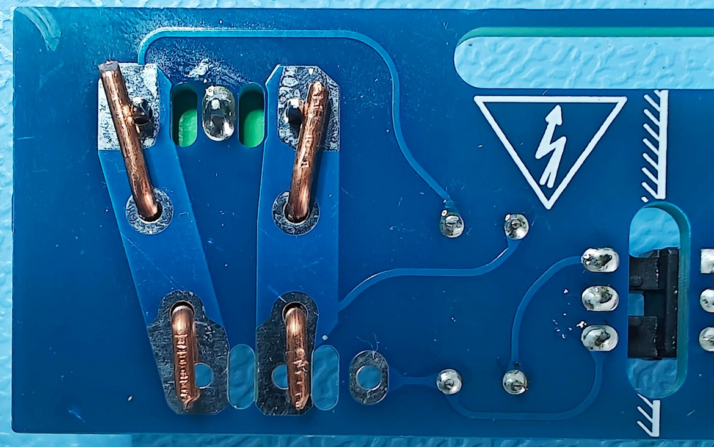
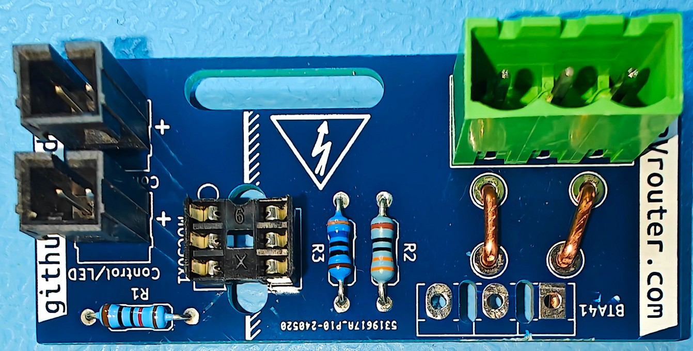
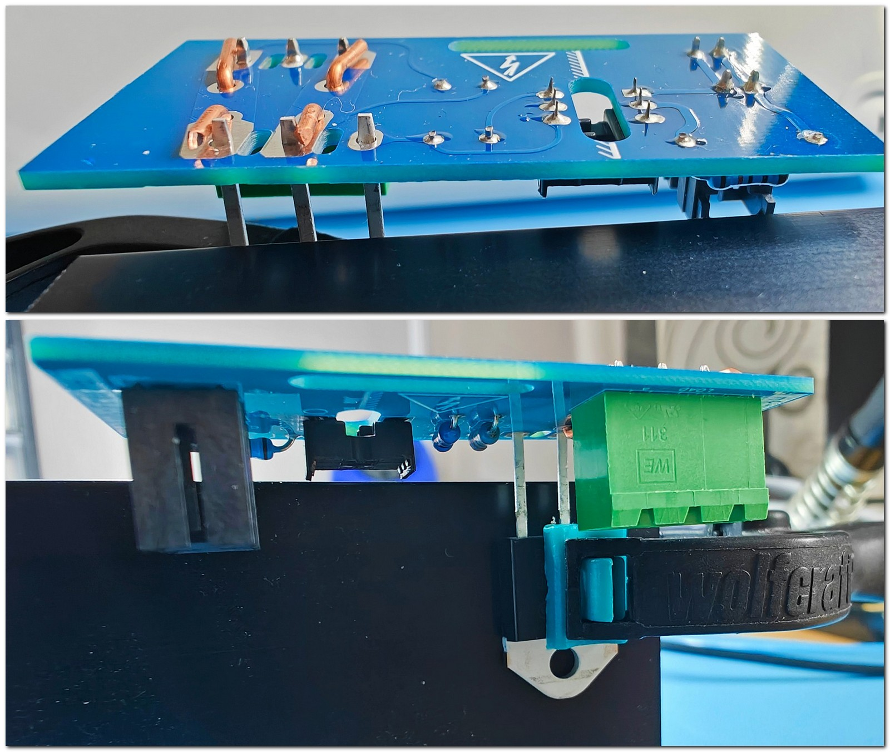
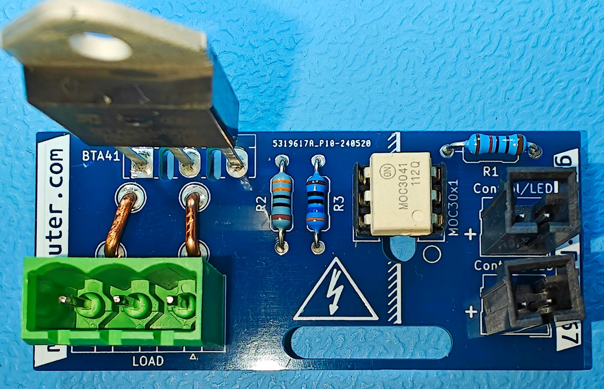

Étage de sortie
---------------

⏱️ **Temps estimé** : 2-3 heures (débutant), 1-1,5 heures (expérimenté)

🔧 **Niveau de difficulté** : Avancé

⚠️ **Niveau de risque** : Élevé (haute puissance, risque d’incendie)

| Le :term:`triac`, également connu sous le nom de triode pour courant alternatif, appartient à la catégorie des thyristors et sert d’interrupteur semi-conducteur. Il a la capacité unique de gérer le courant dans les deux directions, ce qui le rend idéal pour les applications utilisant du courant alternatif (AC).
| Utilisé pour ajuster la puissance fournie à des dispositifs purement résistifs comme des radiateurs, des chauffe-eau ou des lampes à incandescence, le triac permet de moduler avec précision l’énergie distribuée. Cela offre un contrôle fin sur le niveau de chaleur ou d’éclairage produit.

.. contents:: Sommaire
   :local:
   :depth: 1

.. admonition:: 📋 Prérequis

   Avant de commencer ce chapitre :

   ☐ Chapitre :ref:`safety-overview` lu et compris

   ☐ Carte-mère complètement assemblée et testée

   ☐ Outils nécessaires à disposition (fer à souder haute puissance, pince coupante, tournevis)

   ☐ Temps disponible (2-3 heures pour débutant)

   ☐ Extincteur à proximité (soudure haute puissance)

   ☐ Lecture complète du chapitre avant de commencer

Principe de Fonctionnement d’une Sortie Triac
~~~~~~~~~~~~~~~~~~~~~~~~~~~~~~~~~~~~~~~~~~~~~

| Un :term:`triac` est activé par un signal de déclenchement envoyé à sa broche de commande, également connue sous le nom de gâchette ou *gate*.
| Lorsque ce signal dépasse un seuil spécifique, le triac s’active et commence à conduire le courant, permettant ainsi son passage.
| Une fois activé, le triac continue de conduire le courant jusqu’à ce que celui-ci descende en dessous d’un certain niveau, souvent proche de zéro.
| Ce phénomène se produit automatiquement à la fin de chaque demi-cycle du courant alternatif, entraînant l’arrêt du passage du courant.

Contrôle de la Puissance
~~~~~~~~~~~~~~~~~~~~~~~~

| Pour contrôler la puissance fournie à un appareil résistif, on utilise souvent une technique appelée variation de phase ou gradation.
| Elle consiste à retarder l’amorçage du :term:`triac` dans chaque demi-cycle de la tension alternative. En ne déclenchant le triac que pendant une portion de chaque demi-cycle, on réduit la quantité d’énergie fournie à la charge.
| Plus le retard est important, plus la puissance transmise est faible, et inversement.
| Le principal inconvénient de cette méthode est qu’elle génère des harmoniques dans le réseau électrique.

| Une autre approche consiste à ne laisser passer que des sinusoïdes complètes, une technique connue sous le nom de modulation par trains d’ondes ou *burst fire control*.
| Le principal inconvénient de cette méthode est que la gradation est moins précise, mais l’expérience a montré que cela ne pose pas de problème avec les compteurs électriques en France, quel que soit le modèle.
| Le principal **avantage** de cette méthode est qu’elle ne génère aucune harmonique dans le réseau électrique.

| Pour ajuster la puissance délivrée à un dispositif résistif, on emploie couramment une méthode nommée modulation de phase ou gradation.
| Cette technique consiste à retarder l’activation du triac à un moment précis de chaque demi-cycle du courant alternatif.
| En activant le triac seulement durant une partie du demi-cycle, on diminue l’énergie transmise à l’appareil.
| Ainsi, plus le déclenchement du triac est retardé, moins la puissance fournie est élevée, et vice-versa.
| Toutefois, cette méthode a pour inconvénient de produire des harmoniques sur le réseau électrique.

| Une alternative est de permettre uniquement le passage de cycles complets de sinusoïdes, une technique appelée modulation par trains d’ondes ou *burst fire control*.
| Bien que cette méthode offre une gradation moins fine, les tests montrent qu’elle ne présente pas de problème avec les compteurs électriques en France, indépendamment du modèle utilisé.
| Son **avantage principal** réside dans le fait qu’elle n’introduit pas d’harmoniques sur le réseau électrique.

Applications typiques
~~~~~~~~~~~~~~~~~~~~~

* **Éclairage** : Les *dimmers*, ou variateurs de lumière, exploitent les triacs pour moduler l’intensité lumineuse. En ajustant le moment d’activation du :term:`triac`, il est possible de faire varier la luminosité des lampes.
* **Chauffage** : Dans le cas des chauffages électriques, les triacs servent à contrôler la température. En changeant la durée pendant laquelle le courant est conduit, on peut régler la quantité de chaleur émise par l’appareil de chauffage.

Avantages comparés à un relais
^^^^^^^^^^^^^^^^^^^^^^^^^^^^^^

* **Contrôle Fin** : Le :term:`triac` offre une gestion très précise de la puissance, ce qui est parfait pour les applications nécessitant un ajustement délicat.
* **Commutation Sans Bruit** : À l’inverse des relais mécaniques, les triacs fonctionnent sans produire de bruit de clic caractéristique lors de la commutation.
* **Absence de Composants Mobiles** : Le fait qu’il n’y ait pas de composants mobiles diminue l’usure due au mouvement, ce qui rend le système de commutation plus fiable et prolonge sa durée de vie.

Considérations Techniques
~~~~~~~~~~~~~~~~~~~~~~~~~

* **Dissipation Thermique** : L’utilisation des triacs entraîne une production de chaleur pendant leur fonctionnement. Il est crucial d’assurer une bonne évacuation de cette chaleur, généralement à l’aide de dispositifs tels que des radiateurs ou des dissipateurs thermiques.
* **Compatibilité de Charge** : Du fait que le :term:`triac` interrompt le courant de manière périodique, seuls les équipements résistifs (comme les chauffages ou les lampes) sont adaptés pour être contrôlés par un triac.

Composition d’un kit pour étage de sortie triac
~~~~~~~~~~~~~~~~~~~~~~~~~~~~~~~~~~~~~~~~~~~~~~~

Ce kit contient tout le nécessaire pour assembler un circuit de sortie :

* Un **circuit imprimé** qui distingue clairement les zones de basse et de haute tension de chaque côté.
* Une **résistance R1**, dont la valeur est choisie en fonction de la tension nominale du système et du modèle d’:term:`optocoupleur` utilisé.
* Une **résistance R2**, sélectionnée selon le modèle d’optocoupleur.
* Une **résistance R3**.
* Un **support** :term:`DIL` pour l’optocoupleur, comportant deux rangées de trois broches.
* Deux paires de **connecteurs type Molex**.
* Un **isolant** qui assure à la fois l’isolation électrique et la conduction thermique.
* Un **:term:`triac`**, adapté aux exigences spécifiques de l’application.
* Un **connecteur de puissance** qui dispose habituellement de trois broches, la broche centrale étant inutilisée.
* Un **morceau de cuivre massif** de 1.5 mm² de section.
  

   
   Contenu d’un kit de sortie

Assemblage d’une carte de sortie
~~~~~~~~~~~~~~~~~~~~~~~~~~~~~~~~

Pour les cartes de sortie, nous allons procéder de façon similaire, dans cet ordre :

#. résistances
#. support :term:`optocoupleur`
#. connecteur·s Molex
#. connecteur de puissance
#. :term:`triac`

.. danger::
   ⚠️⚠️⚠️ **DANGER — RISQUE D’INCENDIE** ⚠️⚠️⚠️

   Il est crucial de prêter une attention particulière à la **qualité** des soudures sur la section **haute tension** de cette carte.

   Une soudure haute puissance défectueuse peut provoquer :

   **Scénarios Dangereux**

   #. **Surchauffe** → Fonte des plastiques → Dégagement toxique → Incendie
   #. **Arc électrique** → Étincelles → Ignition matériaux → Incendie
   #. **Court-circuit** → Chaleur intense → Fusion composants → Incendie

   **La carte peut prendre feu SANS AVERTISSEMENT à la mise sous tension !**

Mesures de Sécurité OBLIGATOIRES
^^^^^^^^^^^^^^^^^^^^^^^^^^^^^^^^^

Avant de commencer cette section :

☐ **Extincteur présent** — Type ABC minimum, à portée de main

☐ **Détecteur de fumée** — Fonctionnel et testé

☐ **Surface ininflammable** — Travailler sur métal, céramique (PAS bois/plastique)

☐ **Quelqu’un d’autre présent** — En cas d’urgence

☐ **Savoir où est le tableau électrique** — Pour couper alimentation si fumée

☐ **Fenêtres ouvertes** — Pour ventilation et évacuation fumée

☐ **Connaître itinéraire évacuation** — Ne jamais bloquer sorties

Pendant le Premier Test
^^^^^^^^^^^^^^^^^^^^^^^^

- ⚠️ Rester à côté pendant les 5 premières minutes de fonctionnement
- ⚠️ Surveiller odeurs inhabituelles (plastique brûlé)
- ⚠️ Surveiller fumée
- ⚠️ Écouter grésillements anormaux

En Cas de Fumée ou Odeur de Brûlé
^^^^^^^^^^^^^^^^^^^^^^^^^^^^^^^^^^

#. **COUPER ALIMENTATION IMMÉDIATEMENT** (disjoncteur)
#. **NE PAS TOUCHER le routeur** (peut être très chaud)
#. **Si flammes visibles** → Utiliser extincteur CO₂ ou poudre (PAS D’EAU !)
#. **Si fumée importante** → Évacuer et appeler pompiers (18)
#. **Laisser refroidir 30 minutes** minimum avant d’inspecter

Vérification de Qualité
^^^^^^^^^^^^^^^^^^^^^^^^

Avant de mettre sous tension, vérifiez (loupe recommandée) :

☐ Soudure brillante et lisse (pas terne/granuleuse)

☐ Remplissage complet du trou traversant

☐ Soudure visible des DEUX côtés du :term:`PCB`

☐ Pas de micro-fissures

☐ Pas de soudure débordant sur pistes voisines

⚠️ **Si UN SEUL point n’est pas parfait → REFAIRE LA SOUDURE !**

**Votre vie et votre maison valent plus que 5 minutes de travail supplémentaire.**

Installation des *agrafes* en cuivre massif
^^^^^^^^^^^^^^^^^^^^^^^^^^^^^^^^^^^^^^^^^^^

La première étape du montage consiste à installer des *agrafes* en cuivre pur pour augmenter la capacité de la carte à supporter des courants forts.

Il est recommandé d’utiliser du cuivre d’une section transversale de 1,5 mm², compte tenu de la courte distance entre le :term:`triac` et le connecteur de puissance.

Les emplacements pour ces agrafes sont marqués sur le circuit imprimé par des lignes épaisses sur la couche de sérigraphie, avec un espacement d’environ 5 mm entre les trous.

Pour installer les agrafes, commencez par plier le fil de cuivre afin qu’il traverse ces trous.

Puis, pliez les extrémités vers l’extérieur et pressez-les fermement contre la face inférieure du circuit imprimé. L’utilisation d’une pince multiprise facilitera cette tâche, tout en prenant soin de ne pas abîmer le circuit.

Une fois les agrafes correctement mises en place, coupez les quatre extrémités à la longueur nécessaire.

   Vue dessus/dessous, agrafes posées

.. admonition:: ✅ Point de Contrôle — Agrafes en Cuivre

   Avant de continuer, vérifiez :

   ☐ Agrafes en cuivre massif 1,5 mm² correctement installées
   ☐ Extrémités pliées fermement contre le :term:`PCB`
   ☐ Longueur des extrémités coupée correctement
   ☐ Pas de court-circuit avec les pistes adjacentes
   ☐ Agrafes bien fixées et stables

Installation des composants de faible puissance, support :term:`DIL`
^^^^^^^^^^^^^^^^^^^^^^^^^^^^^^^^^^^^^^^^^^^^^^^^^^^^^^^^^^^^^^^^^^^^

Une fois les agrafes de cuivre mises en place, il est temps d’installer les composants qui nécessitent peu de puissance.

Selon le plan du circuit :

* La résistance **R1** doit être de **120 Ω** si le circuit est alimenté en **3,3 V**, ou de **180 Ω** pour une alimentation en **5 V**.
* La résistance **R2** doit avoir une valeur de **330 Ω**.
* La résistance **R3** doit être de **360 Ω**.

.. note::
   Pour des besoins spécifiques, un autre type d’:term:`optocoupleur` pourrait être nécessaire.
   Dans ce cas, les valeurs des résistances peuvent varier.

.. hint::
   Pour assurer que le support :term:`DIL` soit correctement fixé et en contact total avec le circuit imprimé, commencez par souder une seule de ses broches.
   Ensuite, vérifiez que le support est bien en place et parfaitement aligné avant de procéder à la soudure des cinq broches restantes.

   Vue dessus/dessous, résistances et support :term:`DIL` soudés

.. admonition:: ✅ Point de Contrôle — Composants Faible Puissance

   Avant de continuer, vérifiez :

   ☐ Résistances R1, R2, R3 aux bons emplacements (valeurs correctes pour tension système)
   ☐ Support :term:`DIL` bien plaqué contre le :term:`PCB`
   ☐ **Encoche du support :term:`DIL`** correctement orientée
   ☐ Toutes les soudures propres et brillantes
   ☐ Pas de pont de soudure entre les pistes

Soudure des connecteurs type Molex
^^^^^^^^^^^^^^^^^^^^^^^^^^^^^^^^^^

| Ces connecteurs ont une hauteur similaire au connecteur de puissance.
| Il sera recommandé de souder la broche centrale du connecteur de puissance en premier. En effet, ce dernier peut être facilement maintenu pour cette opération grâce aux agrafes précédemment installées.
| Une fois soudé, ce connecteur sera d’une grande aide pour souder les deux autres connecteurs type Molex.

   Connecteur de puissance, broche centrale soudée

   
   Connecteurs type Molex soudés

.. admonition:: ✅ Point de Contrôle — Connecteurs Molex

   Avant de continuer, vérifiez :

   ☐ Connecteur de puissance broche centrale soudée
   ☐ Deux connecteurs type Molex soudés
   ☐ **Détrompeur correctement orienté** (Molex polarisés)
   ☐ Connecteurs bien plaqués contre le :term:`PCB`
   ☐ Soudures solides et propres

Soudure de la partie *haute puissance*/*haute tension*
^^^^^^^^^^^^^^^^^^^^^^^^^^^^^^^^^^^^^^^^^^^^^^^^^^^^^^

.. danger::
   La qualité des soudures est d’une importance **capitale** pour cette étape.

   **Rappel :** Voir les mesures de sécurité OBLIGATOIRES et la vérification de qualité au début de ce chapitre.

   Une soudure défectueuse peut provoquer un incendie lors de la mise sous tension !

Connecteur haute puissance
""""""""""""""""""""""""""

Ce composant peut être maintenu provisoirement en place en pliant légèrement les agrafes en cuivre pour qu’elles pincent les broches saillantes.

Ensuite, avec un fer à souder bien chaud (réglez la température à 450 °C si possible), appliquez généreusement de la soudure.

:term:`triac`
"""""

De la même manière, ce composant peut être maintenu provisoirement en place en pliant légèrement les agrafes en cuivre pour qu’elles pincent les broches saillantes.

Seuls **1** à **2 mm** des pattes du triac devraient dépasser.

Pour faciliter cette opération et aussi pour protéger le triac des hautes températures, il est conseillé de plaquer le triac contre l’un des dissipateurs non encore monté que vous avez à disposition. Vous pouvez utiliser une pince à linge ou toute autre pince à ressort.

   Positionnement du triac

Pour les soudures au niveau de chacune des agrafes, un bon fer chaud et beaucoup de soudure seront nécessaires.

.. warning::
   Lors de la soudure du triac, veillez à bien vérifier que la soudure est *remontée* de l’autre côté du circuit.

   Cela assurera une continuité parfaite mais aussi une solidité accrue.

.. figure:: ../img/Triac-connecteur-soudés.jpg
   :alt: Triac et connecteur soudés
   :align: center
   :scale: 25%

   Triac et connecteur soudés

.. admonition:: ✅ Point de Contrôle — CRITIQUE — Haute Puissance

   ⚠️ **VÉRIFICATION OBLIGATOIRE AVANT MISE SOUS TENSION** ⚠️

   ☐ **Connecteur haute puissance : soudure ABONDANTE et brillante**
   ☐ **Triac : soudure remontée de l’autre côté du :term:`PCB`** (continuité vérifiée)
   ☐ **Soudures agrafes : généreuses et solides** (fer très chaud utilisé)
   ☐ **Aucun brin de cuivre apparent** risquant court-circuit
   ☐ **Inspection visuelle loupe : pas de fissure ni joint froid**

   🔥 Une soudure défectueuse = RISQUE D’INCENDIE 🔥

Installation de l’:term:`optocoupleur`
^^^^^^^^^^^^^^^^^^^^^^^^^^^^^^^^^^^^^^

| L’:term:`optocoupleur`, un composant essentiel doté de 6 broches, sert de liaison entre les sections du circuit fonctionnant à basse et à haute tension.
| Pour l’installer correctement, alignez le repère présent sur le composant (indiqué en rouge) avec le cercle sur le circuit imprimé (:term:`PCB`).

| Une installation inversée de l’:term:`optocoupleur` ne permettra pas au circuit de fonctionner correctement.
| Toutefois, la conception des broches de l’optocoupleur est telle qu’il ne devrait pas être endommagé en cas d’erreur de montage.

   Carte assemblée

.. admonition:: ✅ Point de Contrôle Final — Carte de Sortie Complète

   Avant le test sous tension, vérifiez :

   ☐ **:term:`Optocoupleur` correctement orienté** (repère rouge aligné avec cercle :term:`PCB`)
   ☐ Toutes les soudures haute puissance re-vérifiées (connecteur, :term:`triac`, agrafes)
   ☐ Pas de court-circuit visible (inspection visuelle complète)
   ☐ Pas de flux de soudure résiduel conducteur
   ☐ **Extincteur à portée de main pour le premier test**

Tests
~~~~~

Lors de la construction d’un système complet, il peut être préférable de monter l’étage de sortie finalisé dans le boîtier avant de procéder à son test.

Les conseils suivants sont destinés aux situations où un étage de sortie doit être testé de manière indépendante.

.. danger::
   **Avertissement de Sécurité**

   Pour vérifier le bon fonctionnement du déclencheur et du :term:`triac`, un accès à la tension du réseau électrique **230 V** CA est nécessaire.

   Faites preuve de la plus grande prudence et n’entamez cette étape que si vous avez les compétences nécessaires pour le faire en toute sécurité.

Voici une plate-forme construite qui permet de tester les cartes de sortie avec ou sans le triac soudé en place.

Lors du test d’une carte de sortie, il est important que le triac fasse partie du circuit électrique, sinon tout le courant de charge passera par le circuit :term:`optocoupleur` et un ou plusieurs composants seront alors détruits immédiatement.

En tenant dûment compte de l’avertissement de sécurité ci-dessus, l’approche simple illustrée ci-dessous devrait convenir pour tester des cartes individuelles.
