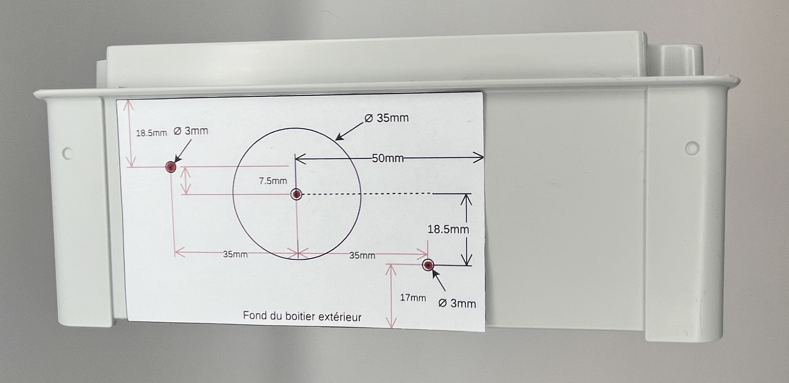

Dissipateur
-----------

Le rôle du dissipateur est d’évacuer la chaleur produite par le courant traversant le triac.

Il s’agit d’une pièce en aluminium dotée d’ailettes, ce qui augmente la surface d’échange avec l’air ambiant.

.. note::
   **À retenir**
   Lors de l’installation finale du boîtier, il est **impératif** de positionner les ailettes en vertical. En effet, l’air chaud étant plus léger que l’air froid, un flux d’air ascendant se crée naturellement, l’air frais étant *aspiré* en bas et l’air chaud expulsé en haut.

Étant donné la taille du dissipateur, il est recommandé de ne pas connecter plus de 3 kW à chaque sortie.

.. _percage-du-dissipateur:

Perçage du dissipateur
~~~~~~~~~~~~~~~~~~~~~~

Chaque dissipateur doit être percé de trois trous : deux pour la fixation sur le boîtier et un au milieu pour le triac.

.. drawio-figure:: ../drawio/dissipateur.drawio
   :alt: Gabarit de perçage
   :align: center
   :page-index: 0
   
   Gabarit de perçage

:download:`Gabarit de perçage <../pdf/dissipateur.pdf>`

Comme indiqué, le perçage sera en 3 mm de diamètre. Pour le trou du milieu, percez d’abord entièrement en 3 mm, puis en 4 mm sur une profondeur de 2 mm.

Ce gabarit devra être imprimé en taille réelle.
Assurez-vous que les dimensions sont correctes une fois imprimées.

Le gabarit sera placé sur la face pleine du dissipateur.

L’utilisation d’une perceuse à colonne est recommandée.

.. _percage-du-boitier:

Perçage du boîtier
~~~~~~~~~~~~~~~~~~

Chaque dissipateur sera monté sur les côtés **verticaux** du boîtier. Selon le nombre de sorties, la taille du boîtier variera.

Selon le cas, il sera possible d’installer le boîtier en mode paysage ou en mode portrait. Chacun fait en fonction des contraintes, en veillant à toujours faire en sorte que les dissipateurs soient dans le sens **vertical**.

Le boîtier doit être percé de trois trous : deux pour la fixation du dissipateur sur le boîtier et un au milieu pour laisser de la place au triac.

.. drawio-figure:: ../drawio/dissipateur.drawio
   :alt: Gabarit de perçage du boîtier
   :align: center
   :page-index: 1
   
   Gabarit de perçage du boîtier

:download:`Gabarit de perçage <../pdf/dissipateur.pdf>`

Comme indiqué, le perçage sera en 3 mm de diamètre. Il est possible de percer en 3,5 mm pour avoir une petite marge en cas d’imprécision du perçage.

Pour le trou du milieu, l’idéal est d’utiliser une fraise ou un foret à étage.

.. figure:: ../img/fraise.jpg
   :alt: Exemple de fraise
   :align: center
   :scale: 25%
   
   Exemple de fraise

Sachant que le trou sera caché par le dissipateur, il n’est pas nécessaire que le trou soit parfaitement propre ou parfaitement circulaire.

Ce gabarit doit être imprimé à taille réelle. Assurez-vous que les dimensions sont correctes une fois imprimées.

Le gabarit sera placé sur la face externe du boîtier, le bas du gabarit le long du bord inférieur du boîtier.
Bien placé, le dissipateur sera en contact avec la collerette périphérique du boîtier.

   
   Positionnement du gabarit sur le boîtier

L’utilisation d’une perceuse à colonne est recommandée.
