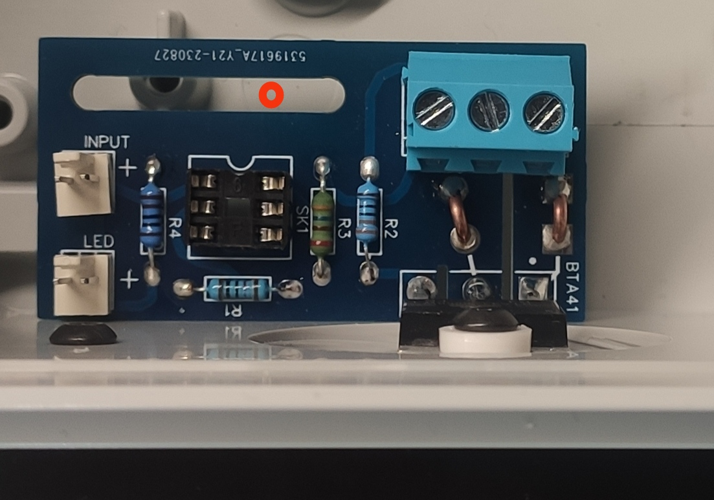

Perçages
========

Les boîtiers utilisés pour ce routeur sont de type industriel, fabriqués en ABS avec un retardateur de flamme.
Ils sont conformes aux normes de sécurité industrielles.

En fonction du nombre de sorties à contrôler, deux références peuvent être fournies :

* Thalassa **NSYTBS24198** : ce boîtier convient pour les configurations à **1** ou **2** sorties, pouvant être installées en mode portrait ou paysage.
* Thalassa **NSYTBS29248** : ce boîtier convient pour les configurations à **3** ou **4** sorties, à installer **uniquement en mode portrait**.

Il y a peu de contraintes à respecter, voici la liste :

* Le **presse-étoupe** doit être installé sur le **côté inférieur** pour protéger contre la poussière et les éventuels ruissellements.
* Le·s **dissipateur·s** doit·vent être installé·s sur le·s côté·s **vertical·aux**. C’est **impératif** pour assurer un bon refroidissement.

Pour le reste — témoins LED, etc. — ils peuvent être montés n’importe où, selon vos préférences !

Cependant, ce guide décrira l’implantation la plus classique.

.. include:: ../common/outils.inc.rst

.. include:: ../common/etapes-prepa.inc.rst

.. include:: ../common/dissipateur.inc.rst

Perçage pour chaque étage de sortie triac
-----------------------------------------

Le triac de la carte de sortie doit être plaqué intégralement et fixé sur le dissipateur en façade du boitier.
L’étage de sortie doit aussi être fixé au fond du boitier à la bonne hauteur pour être en accord avec le point de fixation du triac.

Pour ce faire, il faut fixer le dissipateur sur le boitier préalablement préparé et fixé l’étage de sortie sur celui-ci par l’intermédiaire du triac.

Vu du dessus, il est possible de pointer le futur perçage à l’endroit le plus adéquat dans le trou oblong.

.. figure:: ../img/Pointage-sortie-side.jpg
   :alt: Fixation dissipateur / étage de sortie
   :align: center
   :scale: 25%

   Fixation dissipateur / étage de sortie

   Pointage

Pour percer, l’étage de sortie doit être retiré.
Le perçage doit être effectué avec un foret de **3 mm** de diamètre.

Pour ajuster la hauteur de la carte de sortie, un plot en plastique de **10 mm** de haut est installé à l’aide d’une vis **M3** en plastique.

.. figure:: ../img/Entretoise-sortie.png
   :alt: Plot
   :align: center
   :scale: 25%
   
   Plot

.. _percage-carte-mere:

Perçage pour la carte-mère
--------------------------

Une fois les étages de sortie correctement positionnés, vous pouvez placer la carte-mère de manière à ne pas entraver les futurs branchements et autres équipements.
En utilisant la même méthode, vous pouvez marquer et percer le boîtier aux dimensions appropriées.

.. figure:: ../img/Implantation-Mono.png
   :alt: Pointage carte mère
   :align: center
   :scale: 25%
   
   Pointage carte mère

Pour éviter qu’elle ne repose sur les points de fixation au fond du boîtier, un plot en plastique de **10 mm** de hauteur est installé à l’aide d’une vis **M4** sur tous les trous percés, de la même manière que pour l’étage de sortie.
