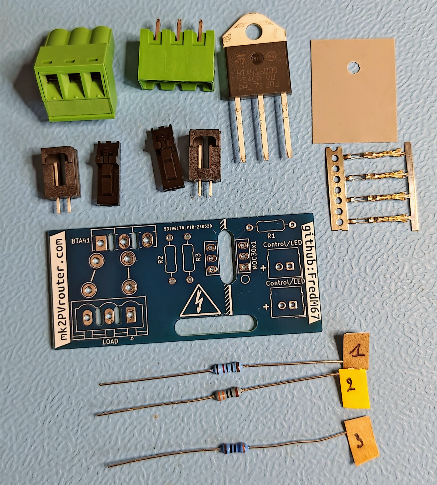
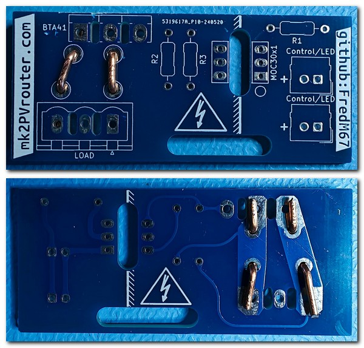
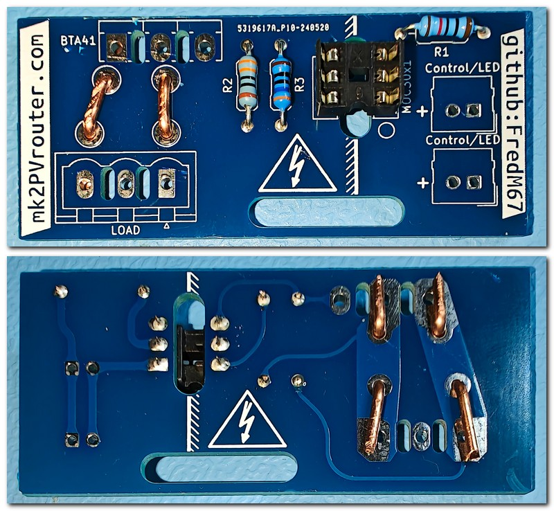
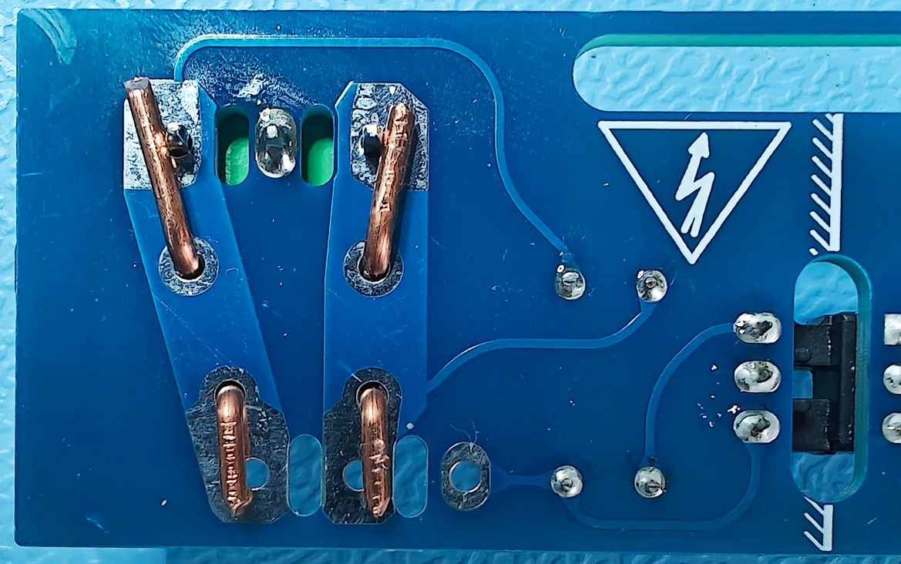
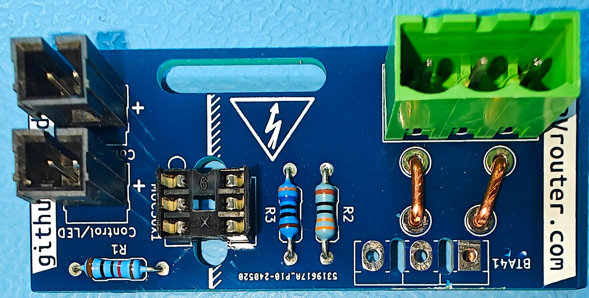
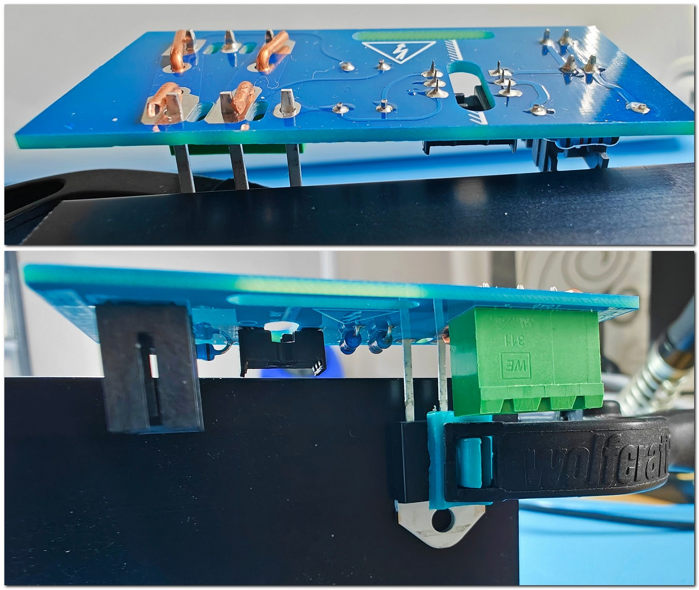
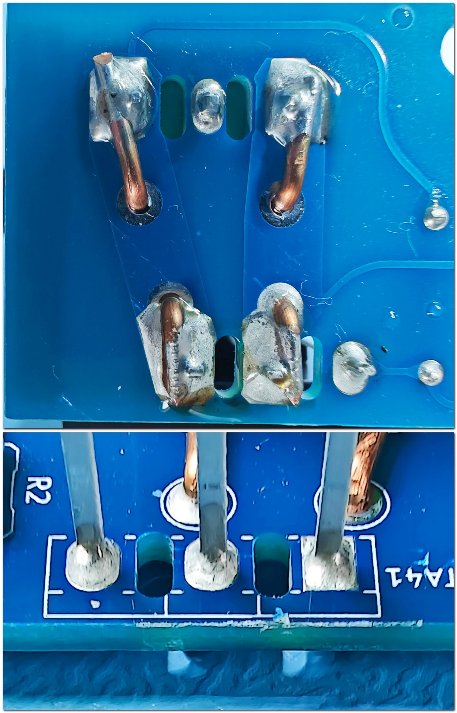
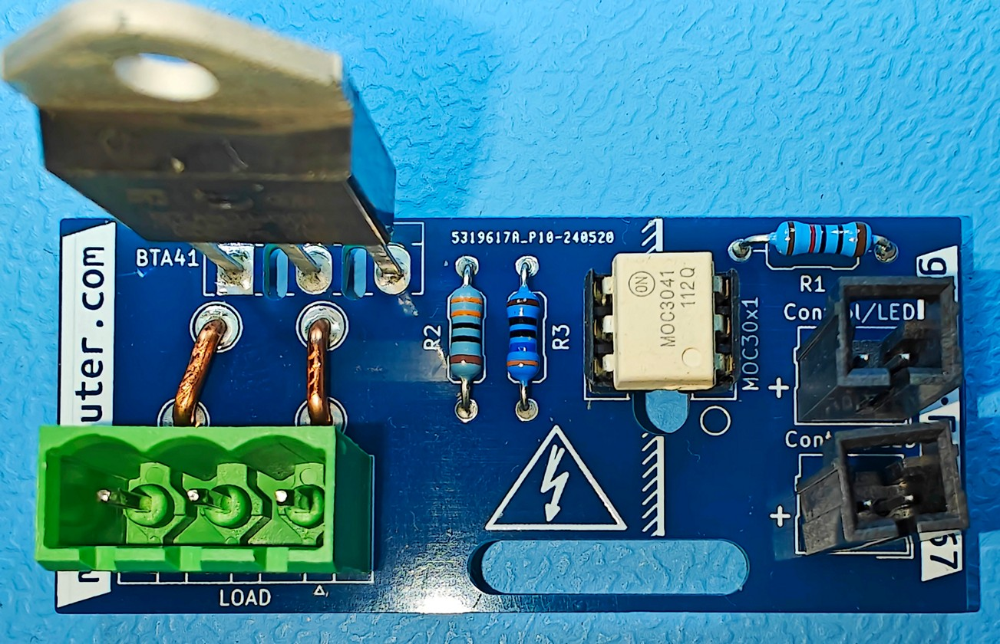

.. _carte-sortie:

================
Étage de sortie
================

⏱️ **Temps estimé** : 2–3 heures (débutant), 1–1,5 heures (expérimenté)

🔧 **Niveau de difficulté** : Avancé

⚠️ **Niveau de risque** : Élevé (haute puissance, risque d’incendie)

| Le :term:`triac <Triac>`, également connu sous le nom de triode pour courant alternatif, appartient à la catégorie des thyristors et sert d’interrupteur semi-conducteur. Il a la capacité unique de gérer le courant dans les deux directions, ce qui le rend idéal pour les applications utilisant du courant alternatif (AC).
| Utilisé pour ajuster la puissance fournie à des dispositifs purement résistifs comme des radiateurs, des chauffe-eau ou des lampes à incandescence, le triac permet de moduler avec précision l’énergie distribuée. Cela offre un contrôle fin sur le niveau de chaleur ou d’éclairage produit.

.. contents:: Sommaire
   :local:
   :depth: 1

.. admonition:: 📋 Prérequis

   Avant de commencer ce chapitre :

   ☐ Chapitre :ref:`safety-overview` lu et compris

   ☐ Carte-mère complètement assemblée et testée

   ☐ Outils nécessaires à disposition (fer à souder haute puissance, pince coupante, tournevis)

   ☐ Temps disponible (2–3 heures pour débutant)

   ☐ Extincteur à proximité (soudure haute puissance)

   ☐ Lecture complète du chapitre avant de commencer

Principe de Fonctionnement d’une Sortie Triac
---------------------------------------------

| Un :term:`triac <Triac>` est activé par un signal de déclenchement envoyé à sa broche de commande, également connue sous le nom de gâchette ou *gate*.
| Lorsque ce signal dépasse un seuil spécifique, le triac s’active et commence à conduire le courant, permettant ainsi son passage.
| Une fois activé, le triac continue de conduire le courant jusqu’à ce que celui-ci descende en dessous d’un certain niveau, souvent proche de zéro.
| Ce phénomène se produit automatiquement à la fin de chaque demi-cycle du courant alternatif, entraînant l’arrêt du passage du courant.

Contrôle de la Puissance
------------------------

| Pour contrôler la puissance fournie à un appareil résistif, on utilise souvent une technique appelée variation de phase ou gradation.
| Elle consiste à retarder l’amorçage du :term:`triac <Triac>` dans chaque demi-cycle de la tension alternative. En ne déclenchant le triac que pendant une portion de chaque demi-cycle, on réduit la quantité d’énergie fournie à la charge.
| Plus le retard est important, plus la puissance transmise est faible, et inversement.
| Le principal inconvénient de cette méthode est qu’elle génère des harmoniques dans le réseau électrique.

| Une autre approche consiste à ne laisser passer que des sinusoïdes complètes, une technique connue sous le nom de modulation par trains d’ondes ou *burst fire control*.
| Le principal inconvénient de cette méthode est que la gradation est moins précise, mais l’expérience a montré que cela ne pose pas de problème avec les compteurs électriques en France, quel que soit le modèle.
| Le principal **avantage** de cette méthode est qu’elle ne génère aucune harmonique dans le réseau électrique.

Applications typiques
---------------------

* **Éclairage** : Les *dimmers*, ou variateurs de lumière, exploitent les triacs pour moduler l’intensité lumineuse. En ajustant le moment d’activation du :term:`triac <Triac>`, il est possible de faire varier la luminosité des lampes.
* **Chauffage** : Dans le cas des chauffages électriques, les triacs servent à contrôler la température. En changeant la durée pendant laquelle le courant est conduit, on peut régler la quantité de chaleur émise par l’appareil de chauffage.

Avantages comparés à un relais
~~~~~~~~~~~~~~~~~~~~~~~~~~~~~~

* **Contrôle Fin** : Le :term:`triac <Triac>` offre une gestion très précise de la puissance, ce qui est parfait pour les applications nécessitant un ajustement délicat.
* **Commutation Sans Bruit** : À l’inverse des relais mécaniques, les triacs fonctionnent sans produire de bruit de clic caractéristique lors de la commutation.
* **Absence de Composants Mobiles** : Le fait qu’il n’y ait pas de composants mobiles diminue l’usure due au mouvement, ce qui rend le système de commutation plus fiable et prolonge sa durée de vie.

Considérations Techniques
-------------------------

* **Dissipation Thermique** : L’utilisation des triacs entraîne une production de chaleur pendant leur fonctionnement. Il est crucial d’assurer une bonne évacuation de cette chaleur, généralement à l’aide de dispositifs tels que des radiateurs ou des dissipateurs thermiques.
* **Compatibilité de Charge** : Du fait que le :term:`triac <Triac>` interrompt le courant de manière périodique, seuls les équipements résistifs (comme les chauffages ou les lampes) sont adaptés pour être contrôlés par un triac.

Composition d’un kit pour étage de sortie triac
-----------------------------------------------

Ce kit contient tout le nécessaire pour assembler un circuit de sortie :

* Un **circuit imprimé** qui distingue clairement les zones de basse et de haute tension de chaque côté.
* Une **résistance R1**, dont la valeur est choisie en fonction de la tension nominale du système et du modèle d’:term:`optocoupleur <Optocoupleur>` utilisé.
* Une **résistance R2**, sélectionnée selon le modèle d’optocoupleur.
* Une **résistance R3**.
* Un **support** :term:`DIL` pour l’optocoupleur, comportant deux rangées de trois broches.
* Deux paires de **connecteurs type Molex**.
* Un **isolant** qui assure à la fois l’isolation électrique et la conduction thermique.
* Un **triac**, adapté aux exigences spécifiques de l’application.
* Un **connecteur de puissance** qui dispose habituellement de trois broches, la broche centrale étant inutilisée.
* Un **morceau de cuivre massif** de 1.5 mm² de section.

   Contenu d’un kit de sortie

Assemblage d’une carte de sortie
--------------------------------

Pour les cartes de sortie, nous allons procéder de façon similaire, dans cet ordre :

#. résistances
#. support :term:`optocoupleur <Optocoupleur>`
#. connecteur·s Molex
#. connecteur de puissance
#. :term:`triac <Triac>`

.. danger::
   ⚠️⚠️⚠️ **DANGER — RISQUE D’INCENDIE** ⚠️⚠️⚠️

   Il est crucial de prêter une attention particulière à la **qualité** des soudures sur la section **haute tension** de cette carte.

   Une soudure haute puissance défectueuse peut provoquer :

   **Scénarios Dangereux**

   #. **Surchauffe** → Fonte des plastiques → Dégagement toxique → Incendie
   #. **Arc électrique** → Étincelles → Ignition matériaux → Incendie
   #. **Court-circuit** → Chaleur intense → Fusion composants → Incendie

   **La carte peut prendre feu SANS AVERTISSEMENT à la mise sous tension !**

Mesures de Sécurité OBLIGATOIRES
~~~~~~~~~~~~~~~~~~~~~~~~~~~~~~~~~

Avant de commencer cette section :

☐ **Extincteur présent** — Type ABC minimum, à portée de main

☐ **Détecteur de fumée** — Fonctionnel et testé

☐ **Surface isolante et ininflammable** — Travailler sur céramique, bois sec (PAS métal/plastique)

☐ **Quelqu’un d’autre présent** — En cas d’urgence

☐ **Savoir où est le tableau électrique** — Pour couper alimentation si fumée

☐ **Fenêtres ouvertes** — Pour ventilation et évacuation fumée

☐ **Connaître itinéraire évacuation** — Ne jamais bloquer sorties

Pendant le Premier Test
~~~~~~~~~~~~~~~~~~~~~~~~

- ⚠️ Rester à côté pendant les 5 premières minutes de fonctionnement
- ⚠️ Surveiller odeurs inhabituelles (plastique brûlé)
- ⚠️ Surveiller fumée
- ⚠️ Écouter grésillements anormaux

En Cas de Fumée ou Odeur de Brûlé
~~~~~~~~~~~~~~~~~~~~~~~~~~~~~~~~~~

#. **COUPER ALIMENTATION IMMÉDIATEMENT** (disjoncteur)
#. **NE PAS TOUCHER le routeur** (peut être très chaud)
#. **Si flammes visibles** → Utiliser extincteur CO₂ ou poudre (PAS D’EAU !)
#. **Si fumée importante** → Évacuer et appeler pompiers (18)
#. **Laisser refroidir 30 minutes** minimum avant d’inspecter

Vérification de Qualité
~~~~~~~~~~~~~~~~~~~~~~~~

Avant de mettre sous tension, vérifiez (loupe recommandée) :

☐ Soudure brillante et lisse (pas terne/granuleuse)

☐ Remplissage complet du trou traversant

☐ Soudure visible des DEUX côtés du :term:`PCB`

☐ Pas de micro-fissures

☐ Pas de soudure débordant sur pistes voisines

⚠️ **Si UN SEUL point n’est pas parfait → REFAIRE LA SOUDURE !**

**Votre vie et votre maison valent plus que 5 minutes de travail supplémentaire.**

Installation des *agrafes* en cuivre massif
~~~~~~~~~~~~~~~~~~~~~~~~~~~~~~~~~~~~~~~~~~~

La première étape du montage consiste à installer des *agrafes* en cuivre pur pour augmenter la capacité de la carte à supporter des courants forts.

Il est recommandé d’utiliser du cuivre d’une section transversale de 1,5 mm², compte tenu de la courte distance entre le :term:`triac <Triac>` et le connecteur de puissance.

Les emplacements pour ces agrafes sont marqués sur le circuit imprimé par des lignes épaisses sur la couche de sérigraphie, avec un espacement d’environ 5 mm entre les trous.

Pour installer les agrafes, commencez par plier le fil de cuivre afin qu’il traverse ces trous.

Puis, pliez les extrémités vers l’extérieur et pressez-les fermement contre la face inférieure du circuit imprimé. L’utilisation d’une pince multiprise facilitera cette tâche, tout en prenant soin de ne pas abîmer le circuit.

Une fois les agrafes correctement mises en place, coupez les quatre extrémités à la longueur nécessaire.

   Vue dessus/dessous, agrafes posées

.. admonition:: ✅ Point de Contrôle — Agrafes en Cuivre

   Avant de continuer, vérifiez :

   | ☐ Agrafes en cuivre massif 1,5 mm² correctement installées
   | ☐ Extrémités pliées fermement contre le :term:`PCB`
   | ☐ Longueur des extrémités coupée correctement
   | ☐ Pas de court-circuit avec les pistes adjacentes
   | ☐ Agrafes bien fixées et stables

Installation des composants de faible puissance, support :term:`DIL`
~~~~~~~~~~~~~~~~~~~~~~~~~~~~~~~~~~~~~~~~~~~~~~~~~~~~~~~~~~~~~~~~~~~~

Une fois les agrafes de cuivre mises en place, il est temps d’installer les composants qui nécessitent peu de puissance.

Selon le plan du circuit :

* La résistance **R1** doit être de **120 Ω** si le circuit est alimenté en **3,3 V**, ou de **180 Ω** pour une alimentation en **5 V**.
* La résistance **R2** doit avoir une valeur de **330 Ω**.
* La résistance **R3** doit être de **360 Ω**.

.. note::
   Pour des besoins spécifiques, un autre type d’:term:`optocoupleur <Optocoupleur>` pourrait être nécessaire.
   Dans ce cas, les valeurs des résistances peuvent varier.

.. hint::
   Pour assurer que le support :term:`DIL` soit correctement fixé et en contact total avec le circuit imprimé, commencez par souder une seule de ses broches.
   Ensuite, vérifiez que le support est bien en place et parfaitement aligné avant de procéder à la soudure des cinq broches restantes.

   Vue dessus/dessous, résistances et support :term:`DIL` soudés

.. admonition:: ✅ Point de Contrôle — Composants Faible Puissance

   Avant de continuer, vérifiez :

   | ☐ Résistances R1, R2, R3 aux bons emplacements (valeurs correctes pour tension système)
   | ☐ Support :term:`DIL` bien plaqué contre le :term:`PCB`
   | ☐ **Encoche du support DIL** correctement orientée
   | ☐ Toutes les soudures propres et brillantes
   | ☐ Pas de pont de soudure entre les pistes

Soudure des connecteurs type Molex
~~~~~~~~~~~~~~~~~~~~~~~~~~~~~~~~~~

| Ces connecteurs ont une hauteur similaire au connecteur de puissance.
| Il sera recommandé de souder la broche centrale du connecteur de puissance en premier. En effet, ce dernier peut être facilement maintenu pour cette opération grâce aux agrafes précédemment installées.
| Une fois soudé, ce connecteur sera d’une grande aide pour souder les deux autres connecteurs type Molex.

   Connecteur de puissance, broche centrale soudée

   Connecteurs type Molex soudés

.. admonition:: ✅ Point de Contrôle — Connecteurs Molex

   Avant de continuer, vérifiez :

   | ☐ Connecteur de puissance broche centrale soudée
   | ☐ Deux connecteurs type Molex soudés
   | ☐ **Détrompeur correctement orienté** (Molex polarisés)
   | ☐ Connecteurs bien plaqués contre le :term:`PCB`
   | ☐ Soudures solides et propres

Soudure de la partie *haute puissance*/*haute tension*
~~~~~~~~~~~~~~~~~~~~~~~~~~~~~~~~~~~~~~~~~~~~~~~~~~~~~~

.. danger::
   La qualité des soudures est d’une importance **capitale** pour cette étape.

   **Rappel :** Voir les mesures de sécurité OBLIGATOIRES et la vérification de qualité au début de ce chapitre.

   Une soudure défectueuse peut provoquer un incendie lors de la mise sous tension !

Connecteur haute puissance
^^^^^^^^^^^^^^^^^^^^^^^^^^

Ce composant peut être maintenu provisoirement en place en pliant légèrement les agrafes en cuivre pour qu’elles pincent les broches saillantes.

Ensuite, avec un fer à souder bien chaud (réglez la température à 450 °C si possible), appliquez généreusement de la soudure.

:term:`triac <Triac>`
^^^^^^^^^^^^^

De la même manière, ce composant peut être maintenu provisoirement en place en pliant légèrement les agrafes en cuivre pour qu’elles pincent les broches saillantes.

Seuls **1** à **2 mm** des pattes du triac devraient dépasser.

Pour faciliter cette opération et aussi pour protéger le triac des hautes températures, il est conseillé de plaquer le triac contre l’un des dissipateurs non encore monté que vous avez à disposition. Vous pouvez utiliser une pince à linge ou toute autre pince à ressort.

   Positionnement du triac

Pour les soudures au niveau de chacune des agrafes, un bon fer chaud et beaucoup de soudure seront nécessaires.

.. warning::
   Lors de la soudure du triac, veillez à bien vérifier que la soudure est *remontée* de l’autre côté du circuit.

   Cela assurera une continuité parfaite mais aussi une solidité accrue.

   Triac et connecteur soudés

.. admonition:: ✅ Point de Contrôle — CRITIQUE — Haute Puissance

   ⚠️ **VÉRIFICATION OBLIGATOIRE AVANT MISE SOUS TENSION** ⚠️

   | ☐ **Connecteur haute puissance : soudure ABONDANTE et brillante**
   | ☐ **Triac : soudure remontée de l’autre côté du PCB** (continuité vérifiée)
   | ☐ **Soudures agrafes : généreuses et solides** (fer très chaud utilisé)
   | ☐ **Aucun brin de cuivre apparent** risquant court-circuit
   | ☐ **Inspection visuelle loupe : pas de fissure ni joint froid**

   🔥 Une soudure défectueuse = RISQUE D’INCENDIE 🔥

Installation de l’:term:`optocoupleur <Optocoupleur>`
~~~~~~~~~~~~~~~~~~~~~~~~~~~~~~~~~~~~~~

| L’:term:`optocoupleur <Optocoupleur>`, un composant essentiel doté de 6 broches, sert de liaison entre les sections du circuit fonctionnant à basse et à haute tension.
| Pour l’installer correctement, alignez le repère présent sur le composant (indiqué en rouge) avec le cercle sur le circuit imprimé (:term:`PCB`).

| Une installation inversée de l’:term:`optocoupleur <Optocoupleur>` ne permettra pas au circuit de fonctionner correctement.
| Toutefois, la conception des broches de l’optocoupleur est telle qu’il ne devrait pas être endommagé en cas d’erreur de montage.

   Carte assemblée

.. admonition:: ✅ Point de Contrôle Final — Carte de Sortie Complète

   Avant le test sous tension, vérifiez :

   | ☐ **Optocoupleur correctement orienté** (repère rouge aligné avec cercle :term:`PCB`)
   | ☐ Toutes les soudures haute puissance re-vérifiées (connecteur, :term:`triac <Triac>`, agrafes)
   | ☐ Pas de court-circuit visible (inspection visuelle complète)
   | ☐ Pas de flux de soudure résiduel conducteur
   | ☐ **Extincteur à portée de main pour le premier test**

Tests
-----

Lors de la construction d’un système complet, il peut être préférable de monter l’étage de sortie finalisé dans le boîtier avant de procéder à son test.

Les conseils suivants sont destinés aux situations où un étage de sortie doit être testé de manière indépendante.

.. danger::
   **Avertissement de Sécurité**

   Pour vérifier le bon fonctionnement du déclencheur et du :term:`triac <Triac>`, un accès à la tension du réseau électrique **230 V** CA est nécessaire.

   Faites preuve de la plus grande prudence et n’entamez cette étape que si vous avez les compétences nécessaires pour le faire en toute sécurité.

Voici une plate-forme construite qui permet de tester les cartes de sortie avec ou sans le :term:`triac <Triac>` soudé en place.

Lors du test d’une carte de sortie, il est important que le :term:`triac <Triac>` fasse partie du circuit électrique, sinon tout le courant de charge passera par le circuit :term:`optocoupleur <Optocoupleur>` et un ou plusieurs composants seront alors détruits immédiatement.

En tenant dûment compte de l’avertissement de sécurité ci-dessus, l’approche simple illustrée ci-dessous devrait convenir pour tester des cartes individuelles.

Configuration du Banc de Test
~~~~~~~~~~~~~~~~~~~~~~~~~~~~~~

**Matériel nécessaire pour le test :**

☐ **Lampe à incandescence** 40–100 W (ou résistance chauffante équivalente)

☐ **Douille E27** avec câble secteur

☐ **Arduino ou microcontrôleur** (pour générer signal de commande)

☐ **Câbles de connexion** dupont mâle-femelle

☐ **Multimètre** (pour vérifier tensions)

☐ **Extincteur** à portée de main

☐ **Surface isolante et ininflammable** (céramique, bois sec — PAS métal)

Schéma de Montage du Test
^^^^^^^^^^^^^^^^^^^^^^^^^^

.. graphviz::
   :caption: Configuration du banc de test pour carte de sortie triac (cliquer pour agrandir)
   :align: center
   :alt: Schéma de test complet pour carte de sortie triac

   digraph test_bench {
       // Configuration générale - Top to Bottom
       rankdir=TB;
       node [shape=box, style="rounded,filled", fontname="Arial"];
       edge [fontname="Arial", fontsize=10];
       splines=ortho;
       nodesep=0.8;
       ranksep=1.0;

       // Arduino en haut (zone basse tension)
       arduino [label="Arduino\nPin 9 (signal)\nGND", fillcolor="#64B5F6", color="#1976D2", fontcolor=white, width=2];

       // Cluster pour la carte de sortie au centre
       subgraph cluster_card {
           label="CARTE DE SORTIE SOUS TEST";
           style="filled,rounded";
           fillcolor="#FFF9E6";
           color="#666666";
           fontsize=12;
           fontcolor="#333333";
           labelloc="t";
           margin=20;

           // Sous-cluster: Colonne BASSE TENSION (gauche)
           subgraph cluster_low_voltage {
               label="Basse Tension";
               style="filled,dashed";
               fillcolor="#E8F5E9";
               color="#2E7D32";
               fontsize=10;
               fontcolor="#2E7D32";

               molex [label="Connecteur\nMolex IN", fillcolor="#90EE90", color="#2E7D32", width=1.5];
           }

           // Isolation galvanique (zone critique au centre)
           opto [label="Optocoupleur\nMOC3043\n━━━━━━━━━━━━━\nISOLATION\nGALVANIQUE", shape=box, fillcolor="#FFD54F", color="#F57C00", fontsize=10, style="filled,bold", width=2.2, height=1.2];

           // Sous-cluster: Colonne HAUTE TENSION (droite)
           subgraph cluster_high_voltage {
               label="Haute Tension";
               style="filled,dashed";
               fillcolor="#FFEBEE";
               color="#C62828";
               fontsize=10;
               fontcolor="#C62828";

               triac [label="Triac\nBTA41", fillcolor="#FF6B6B", fontcolor=white, color="#C62828", width=1.5];
               power_conn [label="Connecteur\nPuissance", fillcolor="#FFB6C1", color="#C2185B", width=1.5];

               // Organisation dans la colonne haute tension
               triac -> power_conn [label="", color="#F44336", penwidth=2];
           }

           // Connexions entre les zones
           molex -> opto [label="  Signal 3.3V-5V  ", color="#4CAF50", fontcolor="#2E7D32", fontsize=9];
           opto -> triac [label="  Déclenchement  ", color="#FF9800", fontcolor="#E65100", style="dashed", fontsize=9, constraint=true];

           // Forcer l’alignement horizontal des deux colonnes
           {rank=same; molex; opto; triac;}
       }

       // Légende en bas à gauche sous la carte
       legend [shape=none, margin=0, label=<
           <table border="0" cellborder="1" cellspacing="0" cellpadding="6">
           <tr><td colspan="2" bgcolor="#E0E0E0"><b>Légende</b></td></tr>
           <tr><td bgcolor="#90EE90">Vert</td><td align="left">Basse tension (3.3V-5V)</td></tr>
           <tr><td bgcolor="#FF6B6B">Rouge</td><td align="left">Haute tension (230V)</td></tr>
           <tr><td bgcolor="#FFD54F">Jaune</td><td align="left">Isolation galvanique</td></tr>
           </table>
       >];

       // Secteur et lampe en bas (zone haute tension)
       secteur [label="⚠️ 230 V ⚠️\nSecteur", fillcolor="#D32F2F", fontcolor=white, color="#B71C1C", penwidth=2, width=2];
       lampe [label="Lampe\nIncandescence\n100 W", shape=ellipse, fillcolor="#FFF59D", color="#F9A825", width=1.8];

       // Connexions externes verticales
       arduino -> molex [label="  Câble dupont (3.3V-5V)  ", color="#2196F3", fontcolor="#1565C0", fontsize=9];
       power_conn -> secteur [label="  Entrée 230V AC  ", color="#D32F2F", fontcolor="#B71C1C", penwidth=2, fontsize=9, dir=back];
       secteur -> lampe [label="  Charge 100W  ", color="#FF5722", fontcolor="#BF360C", penwidth=1.5, fontsize=9];

       // Positionner la légende à gauche, secteur au centre, lampe à droite
       // Utiliser des arêtes invisibles pour forcer l’ordre gauche-droite
       {
           rank=same;
           legend -> secteur -> lampe [style=invis];
       }
   }

Procédure de Test Complète
~~~~~~~~~~~~~~~~~~~~~~~~~~~

.. danger::
   ⚠️ **RAPPEL SÉCURITÉ — 230 V SECTEUR**

   - Extincteur à portée de main
   - Aucun contact avec les parties sous tension
   - Disjoncteur facilement accessible
   - Personne présente pour surveiller
   - Premier test : durée maximale 2 minutes

Étape 1 : Vérifications Préalables (HORS TENSION)
^^^^^^^^^^^^^^^^^^^^^^^^^^^^^^^^^^^^^^^^^^^^^^^^^^

#. **Inspection visuelle complète de la carte**

   ☐ Toutes les soudures haute puissance re-vérifiées

   ☐ Pas de court-circuit visible

   ☐ Pas de composant mal orienté

   ☐ :term:`Optocoupleur` correctement inséré (repère aligné)

#. **Test de continuité au multimètre**

   ☐ Mesurer résistance entre bornes connecteur puissance : **doit être ∞ Ω** (circuit ouvert)

   ☐ Mesurer résistance :term:`optocoupleur <Optocoupleur>` côté commande : **quelques kΩ** (LED interne)

   ☐ Vérifier absence de court-circuit entre pistes basse/haute tension

#. **Montage du banc de test**

   ☐ Connecter lampe au connecteur de puissance de la carte

   ☐ Connecter Arduino pin 9 → Molex IN (signal commande)

   ☐ Connecter Arduino GND → Molex GND

Étape 2 : Test Sans Tension Secteur
^^^^^^^^^^^^^^^^^^^^^^^^^^^^^^^^^^^^

#. **Programmer Arduino avec signal test**

   .. code-block:: cpp

      void setup() {
        pinMode(9, OUTPUT);
      }

      void loop() {
        digitalWrite(9, HIGH);  // Commande ON
        delay(2000);            // 2 secondes
        digitalWrite(9, LOW);   // Commande OFF
        delay(2000);            // 2 secondes
      }

#. **Alimenter Arduino uniquement (PAS de secteur 230 V)**

#. **Mesurer tension aux bornes du :term:`triac <Triac>`** avec multimètre

   - **Signal HIGH** : Devrait y avoir quelques volts (LED :term:`optocoupleur <Optocoupleur>` allumée)
   - **Signal LOW** : 0 V (LED optocoupleur éteinte)

   ✅ Si OK : L’:term:`optocoupleur <Optocoupleur>` fonctionne correctement

   ❌ Si pas de variation : Vérifier soudures, orientation optocoupleur, résistances R1-R3

Étape 3 : Premier Test Sous Tension 230 V
^^^^^^^^^^^^^^^^^^^^^^^^^^^^^^^^^^^^^^^^^^

.. danger::
   ⚠️⚠️⚠️ **DANGER — TENSION MORTELLE 230 V** ⚠️⚠️⚠️

   À partir de maintenant, **AUCUN CONTACT** avec la carte ou la lampe.

   Restez à **50 cm minimum** de la zone de test.

#. **Vérifier une dernière fois :**

   ☐ Lampe correctement connectée

   ☐ Arduino alimenté et programme en cours

   ☐ Extincteur à portée

   ☐ Disjoncteur accessible

#. **Brancher la lampe sur secteur 230 V**

#. **Observer pendant 30 secondes**

   **✅ Comportement NORMAL attendu :**

   - Lampe s’allume et s’éteint toutes les 2 secondes (suivant programme Arduino)
   - Pas d’odeur de brûlé
   - Pas de fumée
   - Pas de grésillement
   - Commutation silencieuse (pas de clic)

   **❌ Comportement ANORMAL — COUPER IMMÉDIATEMENT :**

   - Lampe reste allumée en permanence → :term:`Triac` en court-circuit
   - Lampe ne s’allume jamais → Triac ne conduit pas (défaut ou mal soudé)
   - Fumée ou odeur → Composant en surchauffe
   - Grésillement → Mauvais contact, arc électrique

#. **Si test réussi : Laisser fonctionner 2 minutes**

   - Surveiller température carte (main au-dessus, sans toucher)
   - Carte doit rester froide ou tiède (légèrement chaude acceptable)
   - :term:`Triac` peut être tiède après 2 minutes (normal)

#. **Couper alimentation secteur**

#. **Attendre 1 minute** (décharge condensateurs éventuels)

Étape 4 : Test de Charge Progressive
^^^^^^^^^^^^^^^^^^^^^^^^^^^^^^^^^^^^^

Si le test précédent a réussi, vous pouvez tester avec une charge plus importante.

#. **Remplacer la lampe par une charge plus importante** (100 W ou radiateur 500–1 000 W)

#. **Répéter test pendant 5 minutes**

   - Surveiller température :term:`triac <Triac>` (devrait rester < 60 °C au toucher)
   - Vérifier commutation toujours fonctionnelle

Résultats Attendus du Test
~~~~~~~~~~~~~~~~~~~~~~~~~~~

Carte Fonctionnelle
^^^^^^^^^^^^^^^^^^^

**✅ SUCCÈS — La carte fonctionne correctement si :**

☑ Lampe s’allume/s’éteint selon signal Arduino

☑ Commutation silencieuse (pas de clic mécanique comme relais)

☑ Aucune odeur ou fumée pendant 5 minutes de fonctionnement

☑ Température carte reste raisonnable (< 60 °C)

☑ Pas de grésillement ni arc électrique

**➜ La carte est prête pour l’installation dans le boîtier**

Carte Défectueuse
^^^^^^^^^^^^^^^^^

**❌ ÉCHEC — La carte a un problème si :**

☒ Lampe reste allumée en permanence

   **Diagnostic** : :term:`Triac` en court-circuit (détruit ou mal soudé)

   **Action** : Remplacer triac

☒ Lampe ne s’allume jamais

   **Diagnostic** : Circuit :term:`optocoupleur <Optocoupleur>` défectueux ou :term:`triac <Triac>` ouvert

   **Action** : Vérifier optocoupleur (sens, soudures), vérifier résistances R1-R3

☒ Lampe clignote aléatoirement

   **Diagnostic** : Mauvais contact, soudure froide

   **Action** : Re-vérifier toutes les soudures haute puissance

☒ Fumée ou odeur de brûlé

   **Diagnostic** : Surchauffe composant (soudure insuffisante, court-circuit)

   **Action** : **ARRÊTER IMMÉDIATEMENT**, inspecter visuellement, refaire soudures

☒ Carte chauffe excessivement (> 80 °C)

   **Diagnostic** : Résistance de contact trop élevée (agrafes mal soudées)

   **Action** : Refaire soudures agrafes cuivre avec fer très chaud

Dépannage — Problèmes Courants
-------------------------------

Problème 1 : Lampe Ne S’Allume Jamais
-------------------------------------

**Causes possibles :**

☐ :term:`Optocoupleur` mal inséré (sens inversé)

   **Test** : Retirer optocoupleur, vérifier repère alignement, réinsérer

☐ :term:`Optocoupleur` défectueux

   **Test** : Remplacer par optocoupleur neuf

☐ Résistance R1 mal soudée ou mauvaise valeur

   **Test** : Vérifier continuité, mesurer résistance (120 Ω pour 3,3 V, 180 Ω pour 5 V)

☐ :term:`Triac` défectueux (circuit ouvert)

   **Test** : Mesurer résistance bornes triac (devrait être quelques Ω dans un sens)

☐ Soudure froide sur patte :term:`triac <Triac>`

   **Action** : Refaire soudures triac avec fer très chaud (450 °C)

Problème 2 : Lampe Reste Allumée en Permanence
----------------------------------------------

**Causes possibles :**

☐ :term:`Triac` en court-circuit (détruit)

   **Cause probable** : Surchauffe lors soudure, décharge électrostatique

   **Action** : Remplacer triac (attention ESD lors manipulation)

☐ Pont de soudure entre bornes :term:`triac <Triac>`

   **Test** : Inspection visuelle loupe, vérifier continuité

   **Action** : Retirer excédent soudure avec tresse

☐ Condensateur parasite (rare)

   **Action** : Vérifier pistes :term:`PCB` pas de court-circuit

Problème 3 : Grésillement ou Arc Électrique
-------------------------------------------

**Causes possibles :**

☐ Soudure insuffisante sur agrafes cuivre

   **Symptôme** : Arc entre agrafe et piste :term:`PCB`

   **Action** : **ARRÊTER IMMÉDIATEMENT**, refaire soudures avec beaucoup de soudure

☐ Écart entre :term:`triac <Triac>` et :term:`PCB` (mauvais contact)

   **Action** : Dessouder triac, aplatir pattes, ressouder avec triac bien plaqué

☐ Condensateur de snubber manquant (si prévu sur schéma)

   **Action** : Ajouter condensateur + résistance snubber selon schéma

Problème 4 : Carte Chauffe Excessivement
----------------------------------------

**Causes possibles :**

☐ Résistance de contact trop élevée

   **Diagnostic** : Mesurer tension chute entre agrafe et piste (< 0,1 V attendu)

   **Action** : Refaire soudures avec fer 450 °C + soudure abondante

☐ Section agrafes cuivre insuffisante

   **Action** : Remplacer par cuivre 2,5 mm² au lieu de 1,5 mm²

☐ Charge trop importante pour le dissipateur (> 3 000 W ~ 13 A)

   **Action** : Vérifier puissance charge (doit être ≤ 3 000 W), utiliser dissipateur plus grand si besoin

Validation Finale de la Carte
------------------------------

Checklist Avant Installation
----------------------------

.. admonition:: ✅ Validation Complète — Carte de Sortie

   Avant de considérer la carte comme validée :

   ☐ **Test fonctionnel réussi** : Lampe s’allume/s’éteint correctement

   ☐ **Test charge 100 W réussi** : 5 minutes sans problème

   ☐ **Température acceptable** : Carte et :term:`triac <Triac>` < 60 °C

   ☐ **Aucune odeur ou fumée** durant tous les tests

   ☐ **Soudures haute puissance re-vérifiées** visuellement (loupe)

   ☐ **Pas de grésillement** ni arc électrique

   ☐ **Commutation silencieuse** (caractéristique du triac)

   ☐ **Documentation** : Valeurs R1-R3 notées, tension système (3,3 V ou 5 V) notée

   **Si TOUS les points sont cochés → La carte est validée et prête pour montage final**

Documentation de la Carte Testée
--------------------------------

Il est recommandé de noter sur un papier (à conserver avec la carte) :

- **Date du test** : ___/___/______
- **Tension système** : ☐ 3,3 V  ☐ 5 V
- **Valeur R1** : _____ Ω (120 Ω pour 3,3 V, 180 Ω pour 5 V)
- **Valeur R2** : _____ Ω (330 Ω)
- **Valeur R3** : _____ Ω (360 Ω)
- **Référence :term:`triac <Triac>`** : __________ (ex :  BTA41-600B)
- **Charge testée** : _____ W (ex : 100 W)
- **Durée test** : _____ minutes
- **Résultat** : ☐ ✅ Validée  ☐ ❌ Défectueuse

Prochaines Étapes
-----------------

Après Validation de TOUTES les Cartes
-------------------------------------

Une fois que vous avez assemblé et testé avec succès :

✅ **Carte-mère** (monophasée ou triphasée) — testée électriquement

✅ **Toutes les cartes de sortie** (autant que de sorties souhaitées) — testées individuellement

**Vous pouvez passer aux chapitres suivants :**

#. **Perçages du boîtier** — :ref:`percage-carte-mere`

   Préparer le boîtier pour accueillir les cartes et les dissipateurs

#. **Câblage interne**

   Connexion carte-mère ↔ cartes de sortie ↔ secteur

#. **Montage des dissipateurs**

   Fixation des triacs sur dissipateurs thermiques en façade

#. **Installation du logiciel**

   Téléversement firmware, configuration, étalonnage

#. **Tests système complet**

   Validation fonctionnelle de l’ensemble avant installation finale

.. tip::
   💡 **Conseil Important**

   **Conservez les cartes de sortie testées dans un endroit propre et sec.**

   Évitez de toucher les pistes haute tension avec les doigts (graisse → oxydation).

   Si stockage prolongé (> 1 mois), protégez avec film antistatique.

Ressources Complémentaires
---------------------------

Documentation Technique
-----------------------

- **Datasheet** :term:`triac <Triac>` BTA41 : Caractéristiques électriques, courbes thermiques
- **Datasheet** :term:`optocoupleur <Optocoupleur>` MOC3043 : Schéma interne, caractéristiques LED
- **Guide soudure haute puissance** : :ref:`soldering-tutorial`

.. admonition:: 🎯 Récapitulatif Final

   **Vous avez maintenant assemblé une carte de sortie triac fonctionnelle !**

   Cette carte utilise un :term:`triac <Triac>` BTA41 (40 A nominaux) mais, en raison de la taille du dissipateur, la charge est limitée à **3 000 W** (~13 A à 230 V) pour un fonctionnement sûr et fiable.

   **Points clés à retenir :**

   - Soudures haute puissance = **CRITIQUE** pour sécurité
   - Test progressif (sans tension → basse charge → haute charge)
   - :term:`Triac` fonctionne UNIQUEMENT avec charges résistives
   - Commutation silencieuse = avantage majeur vs relais mécanique

   **Félicitations pour votre travail minutieux ! 🎉**

.. |br| raw:: html

   
