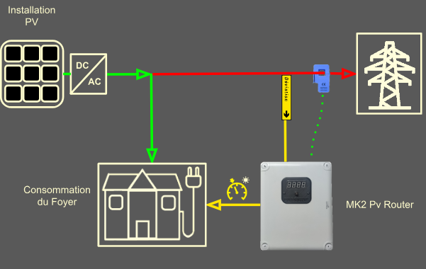
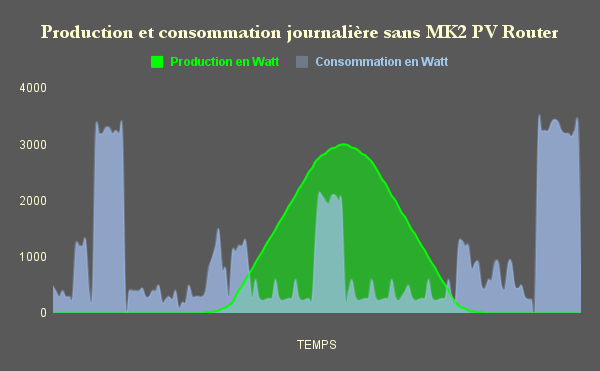
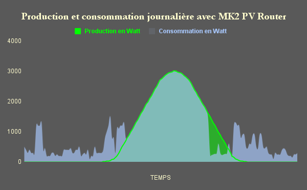

.. _mk2pvrouter:

************************************************
Bienvenue dans la documentation du Mk2PVRouter !
************************************************

| Le MK2 PV Router est l’accessoire indispensable lorsque l’on souhaite optimiser son autoconsommation.
|
| Particulièrement adapté à :

- L’alimentation de résistances (chauffe-eau, radiateur, sol chauffant).
- La gestion des surplus d’énergie vers les équipements raccordés.

| Le routeur surveille en permanence la production d’énergie de votre système en autoconsommation et redirige tout excédent d’électricité vers les charges branchées.
| Grâce aux modules sortie-relais, il peut aussi gérer des installations de chauffage ou toutes sortes d’appareils avec ses fonctions de programmateurs horaire, temporisations, thermostats, préparation ECS, chauffage… toutes configurables librement.
|
| Le routeur est basé sur la carte universelle **3phaseDiverter** qui supporte 4 configurations : monophasé, triphasé avec neutre, triphasé sans neutre et split-phase.
| Seul le type de raccordement au réseau électrique (Enedis ou régie locale) est important, peu importe que la production d’électricité soit en monophasé ou que l’on n’utilise que des appareils monophasés.

.. admonition:: À retenir

   Peu importe l’installation de production d’électricité (monophasée, biphasée, triphasée), le routeur **DOIT** correspondre au type de raccordement au réseau électrique.

   **Exemple** :

   - Si votre raccordement au réseau est triphasé, vous devez utiliser un routeur triphasé, même si votre production est monophasée.

   Schéma montrant l’implantation typique du Mk2PVRouter dans une installation domestique.

| Les 2 graphiques suivants vous montrent une production et une consommation typiques d’un foyer.
| Les pics importants représentent la consommation classique due au fonctionnement d’un chauffe-eau.

   Graphique montrant la production et la consommation typiques d’un foyer **sans** l’utilisation du Mk2PVRouter.

   Graphique montrant la production et la consommation typiques d’un foyer **avec** l’utilisation du Mk2PVRouter.

| Le routeur permet de décaler la consommation du chauffe-eau aux moments où l’on produit sa propre électricité gratuite (hors amortissement du système de production).

.. admonition:: Démarrage rapide

   Pour commencer avec le Mk2PVRouter, suivez ces étapes :

   #. Choisissez votre configuration (voir :ref:`choix-configuration`).
   #. Assemblez le routeur en suivant les instructions de montage du kit.
   #. Effectuez l’étalonnage (voir :ref:`etalonnage-monophase` ou :ref:`etalonnage-triphase`).
   #. Configurez les paramètres de votre routeur et téléchargez le firmware.
   #. Connectez le routeur à votre réseau électrique.
   #. Vérifiez le bon fonctionnement du routeur.
   #. Profitez de votre autoconsommation optimisée !

| Vous trouverez dans cette documentation toutes les informations nécessaires pour assembler, configurer et utiliser le Mk2PVRouter.
| Si vous avez des questions ou des suggestions, n’hésitez pas à nous contacter.

.. toctree::
   :caption: ⚠️ Sécurité (À LIRE EN PREMIER!)
   :hidden:

   safety-overview

.. toctree::
   :maxdepth: 2
   :caption: 📖 Théorie & Concepts
   :hidden:

   introduction
   principe-fonctionnement
   burst-fire-control

.. toctree::
   :maxdepth: 2
   :caption: 🚀 Démarrage (soudure, logiciel)
   :hidden:

   soldering-tutorial
   installation-logiciel

.. toctree::
   :maxdepth: 3
   :caption: 🔨 Carte-mère
   :hidden:

   carte-mere/presentation
   carte-mere/choix-configuration
   carte-mere/assemblage-carte-mere
   carte-mere/assemblage-monophase
   carte-mere/assemblage-triphase
   carte-mere/cavaliers
   carte-mere/tests-electriques

.. toctree::
   :maxdepth: 3
   :caption: ⚡ Étages de sortie
   :hidden:

   etage-sortie/carte-sortie
   etage-sortie/carte-sortie-tests
   etage-sortie/carte-sortie-validation
   etage-sortie/carte-sortie-relais
   etage-sortie/carte-indicateur

.. toctree::
   :maxdepth: 3
   :caption: 📡 Module mk2Wifi
   :hidden:

   mk2wifi/presentation-mk2wifi
   mk2wifi/installation-mk2wifi

.. toctree::
   :maxdepth: 3
   :caption: 📦 Boîtier & Montage
   :hidden:

   boitier/percages
   boitier/confection-cables
   boitier/assemblage

.. toctree::
   :maxdepth: 3
   :caption: 💻 Logiciel & Étalonnage
   :hidden:

   firmware/logiciel-etalonnage-monophase
   firmware/logiciel-etalonnage-triphase

.. toctree::
   :caption: 🏠 Installation Finale
   :hidden:

   installation-finale
   installation-finale-connexions
   installation-finale-mise-en-service

.. toctree::
   :caption: 🔧 Dépannage
   :hidden:

   troubleshooting
   troubleshooting-electrique
   troubleshooting-mk2wifi

.. toctree::
   :caption: 📚 Glossaire

   glossary
