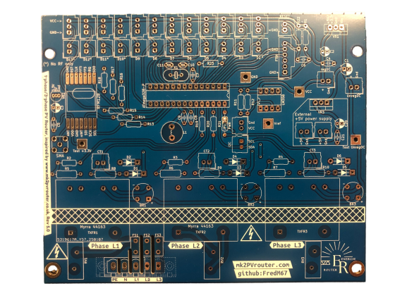
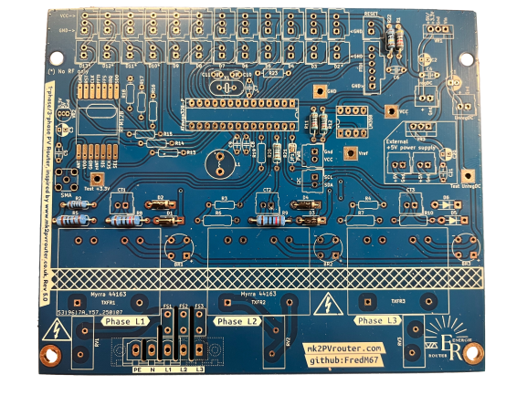
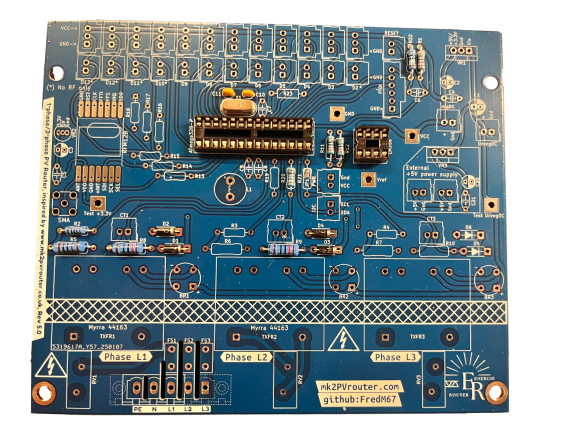
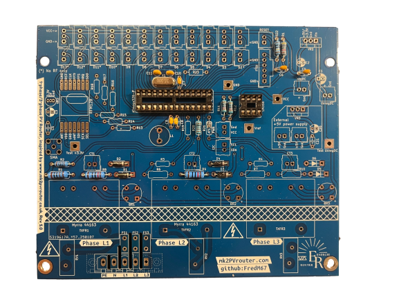
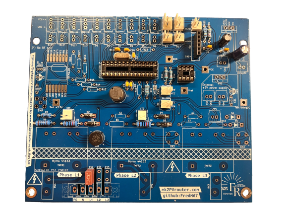
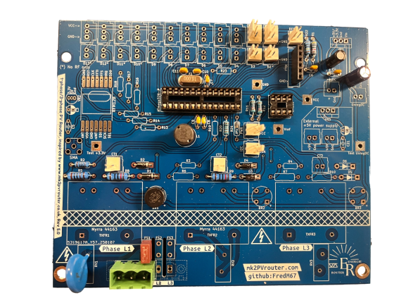
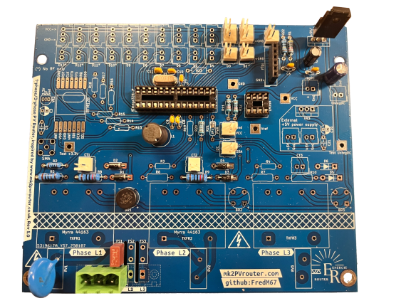

.. _carte-mere-mono-short:

Carte-mère monophasée
=====================

.. contents:: Sommaire
   :local:
   :depth: 1

-------------

.. include:: ../common/ordre-soudure.rst

-------------

Soudure des composants
----------------------

Résistances
~~~~~~~~~~~

   Carte-mère avec résistances soudées

Diodes
~~~~~~

   Carte-mère avec diodes soudées

Supports circuits intégrés
~~~~~~~~~~~~~~~~~~~~~~~~~~

.. figure:: ../img/Carte-mere-mono-03.png
   :align: center
   :alt: Supports CI soudés
   :scale: 50%

   Carte-mère avec supports CI soudés

Condensateurs céramiques et oscillateur
~~~~~~~~~~~~~~~~~~~~~~~~~~~~~~~~~~~~~~~

   Carte-mère avec oscillateur et ses condensateurs associés soudés

   Carte-mère avec condensateurs céramiques soudés

Pont redresseur ou pont de diodes
~~~~~~~~~~~~~~~~~~~~~~~~~~~~~~~~~

   Carte-mère avec pont redresseur soudé

Fusible
~~~~~~~

!! Manque photo !!

Connecteur secteur
~~~~~~~~~~~~~~~~~~

!! Manque photo !!

Connecteurs SIL/Molex
~~~~~~~~~~~~~~~~~~~~~

!! Manque photo !!

Inductance
~~~~~~~~~~

!! Manque photo !!

Condensateurs électrolytiques
~~~~~~~~~~~~~~~~~~~~~~~~~~~~~

   Carte-mère avec condensateurs électrolytiques soudés

Varistance
~~~~~~~~~~

   Carte-mère avec varistance soudée

Régulateur de tension
~~~~~~~~~~~~~~~~~~~~~

.. figure:: ../img/Carte-mere-mono-14.png
   :align: center
   :alt: Régulateur de tension soudé
   :scale: 50%

   Carte-mère avec régulateur de tension soudé

Transformateur
~~~~~~~~~~~~~~

   Carte-mère avec transformateur soudé
