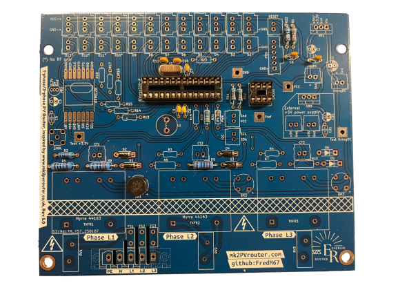
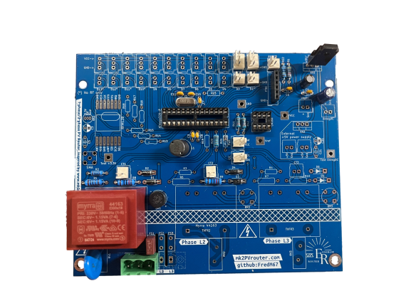

.. _carte-mere-mono:

Carte-mère monophasée
=====================

Plusieurs versions du :term:`PCB` peuvent exister.

Bien qu’elles fonctionnent toutes de la même manière, chaque nouvelle version offre plus de flexibilité que la précédente ainsi que quelques améliorations mineures, essentiellement des aspects pratiques (facilité d’accès des entrées/sorties de l’Arduino…).

La carte-mère monophasée est désormais basée sur la conception de la carte-mère triphasée, ce qui permet de mutualiser certains composants et d’améliorer la compatibilité entre les deux versions. |br|
Cependant, certains composants spécifiques à la version triphasée seront absents sur la carte monophasée, car ils ne sont pas nécessaires pour son fonctionnement.

.. hint::
   | Après chaque étape, il conviendra de vérifier les soudures effectuées (l’utilisation d’une loupe facilitera la vérification).
   | Ensuite, on pourra couper **à ras** toutes les pattes qui dépassent avec une petite pince coupante afin de faire place nette pour l’étape suivante.

.. contents:: Sommaire
   :local:
   :depth: 1

.. note::
   Une version courte de ce guide, contenant uniquement les photos des étapes de soudure, est disponible :ref:`ici <carte-mere-mono-short>`.

-------------

.. include:: ../common/ordre-soudure.rst

-------------

Soudure des composants
----------------------

Résistances
~~~~~~~~~~~

Ces composants n’ont pas de sens et sont très peu sensibles à l’électricité statique.

Les valeurs des résistances sont indiquées sur le schéma de circuit et sont répétées ici pour plus de commodité :
(veuillez lire les notes ci-dessous qui concernent ces valeurs de composants)

* **R1** = **47 kΩ**. Cela fournit le :term:`pull-up` pour la ligne de réinitialisation du processeur.
* **R2** = **100 Ω** ou **180 Ω**. Elle réduit la taille du signal :term:`AC` du transformateur.
* **R5** = **1 kΩ**. Elle réduit la taille du signal :term:`AC` du transformateur.
* **R8** = **120 Ω** ou **150 Ω** en général. Il s’agit de la résistance de charge (ou :term:`burden`) du capteur de courant *grille*, qui utilise :term:`CT`\1.
* **R9** = **120 Ω** ou **150 Ω** en général. Il s’agit de la résistance de charge (ou :term:`burden`) du capteur de courant *diversion*, qui utilise :term:`CT`\2.
* **R11-R12** = **10 kΩ**. Ensemble, elles fournissent une tension de référence pour les capteurs d’entrée.
* **R19-R20** = **1 kΩ**. Elles sont chacune en série avec un :term:`CT` pour protéger le processeur des signaux importants.
* **R22** = **1 MΩ**. Cela fournit le :term:`pull-up` pour la ligne de réinitialisation du processeur.

.. figure:: ../img/Carte-mere-mono-01.png
   :align: center
   :alt: Résistances soudées
   :scale: 50%

   Carte-mère avec résistances soudées

.. note::

   Des valeurs inférieures pour **R2** et **R5** sont désormais utilisées pour augmenter la charge sur le transformateur.
   Cela peut l’empêcher d’entrer en saturation, ce qui déformerait la forme d’onde de sortie. |br|
   **R2** = **100 Ω** convient pour un fonctionnement en **3,3 V**. |br|
   Pour une meilleure utilisation de la plage d’entrée de l’:term:`ADC`, **R2** doit être augmenté à **180 Ω** pour un fonctionnement en **5 V**.
   
   La valeur pour **R8-R9** a été initialement spécifiée comme étant **150 Ω**.
   
   Lorsque le processeur fonctionne à **3,3 V**, cela donne une plage de fonctionnement d’environ **4 kW**. En réduisant ces valeurs à **120 Ω**, la plage est augmentée à **~5 kW**.
   
   Pour un système **5 V**, la valeur originale de **150 Ω** donne une plage de fonctionnement d’environ **6 kW**.
   
   Ces valeurs de résistance de charge s’appliquent lorsque le processeur fonctionne à **3,3 V**. S’il fonctionne à **5 V**, ces plages sont augmentées d’environ **50 %**.
   
   Ces puissances s’entendent sur chaque phase.
   
   .. include:: ../common/burden-calc.inc.rst

Diodes
~~~~~~

Ensuite, les diodes **D1** à **D4** peuvent être ajoutées.

Celles-ci offrent un certain degré de protection au processeur lorsque des courants élevés traversent les CTs.

.. attention::

   Les diodes sont polarisées. |br|
   Elles doivent être placées selon le repérage sur la couche sérigraphiée.

.. figure:: ../img/Carte-mere-mono-02.png
   :align: center
   :alt: Diodes soudées
   :scale: 50%

   Carte-mère avec diodes soudées

Supports circuits intégrés
~~~~~~~~~~~~~~~~~~~~~~~~~~

Ensuite, on installe généralement les supports pour les circuits intégrés.

.. attention::
   Chaque support a une encoche à une extrémité. Celle-ci doit être alignée avec la marque correspondante sur la couche sérigraphiée, comme indiqué ici.

Avec le support convenablement soutenu par le bas (on peut aussi utiliser un morceau d’adhésif), les deux broches situées dans les coins opposés peuvent être soudées en place. |br|
Si un réalignement du composant est nécessaire, il doit être effectué **avant** que les broches restantes ne soient fixées.

.. figure:: ../img/Carte-mere-mono-03.png
   :align: center
   :alt: Supports CI soudés
   :scale: 50%

   Carte-mère avec supports CI soudés

Condensateurs céramiques et oscillateur
~~~~~~~~~~~~~~~~~~~~~~~~~~~~~~~~~~~~~~~

Ces composants ne sont pas polarisés.

Les condensateurs céramiques sont en général orange, et ont la forme d’une goutte d’eau, par opposition aux condensateurs électrolytiques polarisés de forme cylindriques et bleus ou noirs.

.. note::
   Parmi le jeu de condensateurs céramiques, deux d’entre eux sont plus petits que les autres.

   Il s’agit des deux condensateurs associés à l’oscillateur, leur valeur est de **22 pF** et sont référencés **C10** et **C11**.

   **C4** et **C6-C9** sont des condensateurs céramiques de **100 nF**, généralement marqués *104*.

.. note::
   L’oscillateur ainsi que ses deux condensateurs associés peuvent être soudés légèrement au-dessus du :term:`PCB`. |br|
   C’est une habitude, mais ce n’est pas nécessaire pour le bon fonctionnement. |br|
   Pour ce faire, on pourra utiliser une allumette le temps d’effectuer la soudure.

.. figure:: ../img/Carte-mere-mono-04.png
   :align: center
   :alt: Oscillateur et ses condensateurs associés soudés
   :scale: 50%

   Carte-mère avec oscillateur et ses condensateurs associés soudés

.. figure:: ../img/Carte-mere-mono-05.png
   :align: center
   :alt: Condensateurs céramiques soudés
   :scale: 50%

   Carte-mère avec condensateurs céramiques soudés

Pont redresseur ou pont de diodes
~~~~~~~~~~~~~~~~~~~~~~~~~~~~~~~~~

Le rôle de ce composant, repéré **BR1**, est de redresser le courant alternatif fourni par le transformateur. |br|
C’est la première étape nécessaire pour obtenir une alimentation en courant continu.

Sur la figure ci-après, la courbe du haut correspond à la tension fournie par le transformateur. |br|
La courbe du bas est la tension fournie par le redresseur.

.. figure:: ../img/Redresseur-monophase.png
   :alt: Redressement double alternance monophasé
   :align: center
   :scale: 50%

   Redressement double alternance monophasé

.. attention::
   Le pont redresseur est polarisé. |br|
   Il faudra bien veiller à faire correspondre le marquage sur le boîtier avec celui de la couche sérigraphiée.

La broche la plus longue correspond au **+**.

Comme pour l’oscillateur, il est courant de les souder légèrement au-dessus du :term:`PCB`.

   Carte-mère avec pont redresseur soudé

Fusible
~~~~~~~

Le fusible est simple à mettre en place. Il est repéré **FS1**. |br|
Cependant, il faudra veiller à ne pas trop le chauffer lors de la soudure, car il risquerait de fondre à l’intérieur. |br|
En effet, c’est le principe même de fonctionnement d’un fusible !

Connecteur secteur
~~~~~~~~~~~~~~~~~~

Le connecteur secteur peut maintenant être installé. |br|
En raison des pistes du plan masse, la broche référencé **PE** nécessitera plus de chaleur que les autres broches.
Ce bornier doit être orienté correctement pour permettre un accès facile au câblage. |br|
Il est très facile de se tromper de sens ! |br|
Enfin, il faudra veiller à bien le plaquer contre le :term:`PCB` avant de souder, afin que la surface entière du connecteur soit en contact avec le :term:`PCB`.

.. attention::
   En monophasé, le connecteur dispose de **3 broches**, il doit être positionné correctement. |br|
   Le :term:`PCB` est conçu pour un connecteur à **5 broches**, mais seules **3 broches** de gauche, repérées **PE**, **N** et **L1** sont utilisées. |br|
   Assurez-vous que les broches du connecteur correspondent aux marquages sur la couche sérigraphiée pour éviter tout problème de connexion.

Connecteurs SIL/Molex
~~~~~~~~~~~~~~~~~~~~~

Les connecteurs Molex sont *polarisés*, ils possèdent un détrompeur. |br|
Physiquement, ce sont des composants passifs, mais étant donné qu’ils serviront à la connexion d’autres composants ou modules polarisés, il est important de les souder selon le marquage sur la couche sérigraphiée.

Les connecteurs SIL, ou *pin header*, peuvent être soudés dans n’importe quel sens.
Cependant, il est fortement conseillé de choisir un sens par rapport à la sérigraphie, afin de faciliter le câblage ultérieur.

Ils seront plus ou moins nombreux selon la configuration :

* 2 connecteurs à **2 pôles** pour les pinces ampèremétriques, référencés :term:`CT`\1 - :term:`CT`\2
* 1 connecteur à **2 pôles** pour le bouton *reset*, référencé **Reset**
* 1 connecteur à **6 pôles** pour le connecteur :term:`FTDI`, référencé **FTDI**
* 1 connecteur à **2 pôles** par sortie, référencé parmi **D3-D13**.

Inductance
~~~~~~~~~~

Ce composant n’est pas polarisé. Il est référencé **L1**, à proximité de l’**ATmega328-P**.

Condensateurs électrolytiques
~~~~~~~~~~~~~~~~~~~~~~~~~~~~~

Les deux condensateurs électrolytiques, **C1** et **C2**, sont polarisés et doivent donc être installés dans le bon sens.
La broche **-ve** est indiquée par une bande proéminente, en général blanche, sur toute la longueur du composant.

L’autre broche est la **+ve**, qui doit aller dans le trou marqué **+** sur la couche sérigraphiée.

.. attention::
   Bien qu’ils se ressemblent assez, il est important que ces deux condensateurs soient installés aux bons endroits.

   Le plus grand condensateur (**C1** = **100 μF**) est le plus proche du bord du :term:`PCB`. |br|
   Le plus petit (**C2** = **10 μF**) est le plus proche de **VR1**.

   Si ces deux composants sont inversés, les symptômes qui en résultent peuvent être difficiles à diagnostiquer.

.. figure:: ../img/Carte-mere-mono-12.png
   :align: center
   :alt: Condensateurs électrolytiques soudés
   :scale: 50%

   Carte-mère avec condensateurs électrolytiques soudés

Varistance
~~~~~~~~~~

La varistance est un composant de protection contre les surtensions. |br|
Elle est repérée **VR1**. Elle n’est pas polarisée et peut être installée dans n’importe quel sens.

.. figure:: ../img/Carte-mere-mono-13.png
   :align: center
   :alt: Varistance soudée
   :scale: 50%

   Carte-mère avec varistance soudée

Régulateur de tension
~~~~~~~~~~~~~~~~~~~~~

Le régulateur de tension (**VR1**) doit être installé de manière à ce que son ailette métallique soit côté intérieur, comme indiqué sur la sérigraphie. |br|
En fonction de l’application, le **VR1** sera une version **3,3 V** ou **5 V**.

La soudure des broches du **VR1** nécessitera probablement une température plus élevée. |br|
Pour réduire la quantité de métal à chauffer, il est possible de couper préalablement ces broches à la longueur requise.

.. figure:: ../img/Carte-mere-mono-14.png
   :align: center
   :alt: Régulateur de tension soudé
   :scale: 50%

   Carte-mère avec régulateur de tension soudé

Transformateur
~~~~~~~~~~~~~~

Le dernier composant à installer est le transformateur, il est repéré **TXFR1**. C’est un transformateur double de **6 V**, comme indiqué sur la couche sérigraphiée.
Ces transformateurs de **6 V** peuvent alimenter un régulateur de tension de **3,3 V** ou de **5 V**.

.. important::
   Lors du montage de ce composant, il ne doit y avoir aucun espace entre la base du transformateur et la carte de circuit imprimé :term:`PCB`.

   Carte-mère avec transformateur soudé

-------------

Tests électriques
-----------------

Une fois le transformateur en place, la carte est maintenant prête pour les tests électriques. |br|

C’est le bon moment pour vérifier que tous les joints soudés sont en bon état et que toutes les éclaboussures de soudure ont été éliminées.

Test de l’alimentation
~~~~~~~~~~~~~~~~~~~~~~~~~~~~~~~~

Avant d’installer les circuits intégrés, le fonctionnement de l’alimentation doit être vérifié.

.. danger::
   **Alerte de sécurité**

   Pour poursuivre cette séquence de construction, un accès à la tension secteur **230 V** est requis.

   Veuillez ne pas passer à cette étape suivante à moins que vous soyez compétent pour le faire.

Nous effectuerons le test suivant en alimentant le routeur via le connecteur secteur. |br|

Si tout a été correctement assemblé, la sortie de l’alimentation devrait être d’environ **3,3 V**… ou **5 V** si un régulateur de tension **5 V** a été installé.

Cette tension peut être facilement vérifiée au niveau du point de test **Test VCC**, ainsi que **Test GND**, comme indiqué ici.

.. hint::
   N’oubliez pas de mettre votre multimètre sur la position *courant continu*, :term:`DC`, symbole **⎓** !

À l’exception du transformateur, qui peut sembler légèrement chaud après plusieurs minutes, aucun des composants de la carte ne doit présenter d’augmentation notable de la température.

.. include:: ../common/tests-electriques.rst

.. |br| raw:: html

   