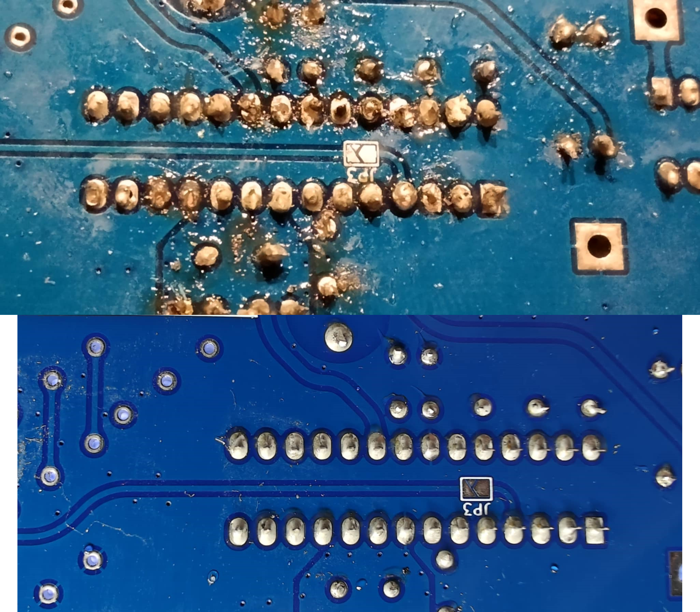

.. _soldering-tutorial:

Guide de Soudure pour Débutants
================================

⏱️ **Temps de lecture** : 30–45 minutes

🔧 **Niveau de difficulté** : Débutant (guide pratique)

⚠️ **Niveau de risque** : Moyen (fer chaud, fumées)

Ce guide complet vous apprendra les bases de la soudure électronique, une compétence essentielle pour assembler votre Mk2PVRouter. Même si vous n’avez jamais soudé auparavant, ce tutoriel vous guidera pas à pas.

.. contents:: Sommaire
   :local:
   :depth: 2

Pourquoi Apprendre à Souder ?
------------------------------

La soudure est une compétence fondamentale en électronique :

✅ **Connexions permanentes** : Crée des liaisons électriques solides et durables

✅ **Fiabilité** : Meilleure que les connexions par pression ou vissage

✅ **Compacité** : Permet des assemblages miniaturisés

✅ **Réparabilité** : Permet de remplacer des composants défectueux

.. important::
   🎯 **Objectif de ce guide**

   À la fin de ce tutoriel, vous serez capable de :

   - Préparer votre poste de travail de manière sécurisée
   - Tenir correctement un fer à souder
   - Réaliser des soudures propres et fiables
   - Identifier une bonne soudure d’une mauvaise
   - Corriger vos erreurs (dessoudage)

Avant de Commencer — Pratique Recommandée
------------------------------------------

.. tip::
   📚 **FORTEMENT RECOMMANDÉ : Pratiquer d’abord sur un kit d’entraînement**

   Avant de souder votre Mk2PVRouter (composants coûteux), achetez un **kit de pratique soudure** :

   - **Coût** : 5–15 € sur AliExpress, Amazon, eBay
   - **Type** : Kit « LED clignotante », « sirène électronique », ou plaque d’entraînement
   - **Durée** : 2–3 heures de pratique suffisent
   - **Bénéfice** : Apprendre sur des composants à 5 € plutôt qu’à 50 €

   **Recherchez** : « soldering practice kit », « soudure kit débutant », « DIY soldering »

Sécurité — Points Essentiels
-----------------------------

.. danger::
   ⚠️ **DANGERS DE LA SOUDURE**

   - **Brûlures** : Le fer à souder atteint **350–450 °C** (température capable de brûler instantanément la peau)
   - **Fumées toxiques** : Les vapeurs de flux contiennent des produits chimiques irritants
   - **Projections** : Gouttes de soudure fondue peuvent jaillir
   - **Électricité** : Fer branché sur secteur 230 V

Équipement de Protection
^^^^^^^^^^^^^^^^^^^^^^^^^

☐ **Lunettes de protection** (obligatoire — projections de soudure)

☐ **Ventilation** ou extracteur de fumées (obligatoire — fumées toxiques)

☐ **Surface de travail ininflammable** (tapis silicone, carrelage, plaque métal)

☐ **Vêtements longs** (manches longues, pas de synthétique)

☐ **Lampe de bureau** (éclairage direct sur zone de travail)

☐ **Eau à proximité** (en cas de brûlure légère)

.. warning::
   🚫 **INTERDICTIONS ABSOLUES**

   - ❌ Ne JAMAIS toucher la panne du fer (même éteint récemment)
   - ❌ Ne JAMAIS laisser le fer sans surveillance
   - ❌ Ne JAMAIS inhaler volontairement les fumées
   - ❌ Ne JAMAIS souder sans ventilation
   - ❌ Ne JAMAIS poser le fer sur une surface inflammable

Matériel Nécessaire
-------------------

Équipement de Base (Essentiel)
^^^^^^^^^^^^^^^^^^^^^^^^^^^^^^

.. danger::
   ⚠️ **N’ACHETEZ PAS D’ÉQUIPEMENT PREMIER PRIX !**

   **Les fers à souder bas de gamme (< 20 €) et la soudure de mauvaise qualité rendront l’apprentissage BEAUCOUP PLUS DIFFICILE.**

   Symptômes du matériel bas de gamme :

   - **Fer sans thermostat** : Température incontrôlée, composants détruits
   - **Chauffe irrégulière** : Soudures froides ou surchauffe aléatoire
   - **Panne qui s’oxyde immédiatement** : Impossible de souder proprement
   - **Soudure sans flux** : Ne coule pas, ne « mouille » pas les pistes
   - **Soudure contaminée** : Crache, fait des bulles, joints granuleux

   **Résultat** : Vous penserez que c’est de votre faute, alors que c’est le matériel !

   **Investissez dans du matériel correct (40–80 €)** — c’est la différence entre réussir et abandonner par frustration.

**1. Station de soudure** (40–80 €)

   - **Température réglable** : 300–450 °C
   - **Panne fine** : 1–2 mm de diamètre (type « biseauté » ou « conique »)
   - **Support avec éponge** : Pour nettoyer la panne
   - **Marques recommandées** : Weller, Hakko, JBC (pro), ou entrée de gamme : Yihua, Aoyue

   .. note::
      Évitez les fers « premier prix » sans réglage de température (< 20 €). Ils surchauffent et détruisent les composants.

**2. Fil de soudure** (5–10 €)

   - **Type** : Étain avec flux intégré (*rosin core*)
   - **Alliage** :

     - **Sn60/Pb40** (60 % étain, 40 % plomb) : Plus facile pour débuter, **température 190 °C**
     - **Sn99/Cu1** (sans plomb) : Écologique, **température 220 °C**, un peu plus difficile

   - **Diamètre** : **0,7–1,0 mm** (idéal pour électronique)
   - **Flux** : Intégré (2–3 % minimum)

   .. warning::
      ⚠️ **Soudure au plomb**

      Le plomb est toxique. Si vous utilisez de la soudure plombée :

      - Se laver les mains après soudure (OBLIGATOIRE)
      - Ne pas manger/boire pendant la soudure
      - Bonne ventilation indispensable

**3. Support de fer** (inclus avec station, ou 5–10 € séparé)

   - **Base lourde** : Stable, ne bascule pas
   - **Éponge humide** : Pour nettoyer la panne
   - **Laine de cuivre** (optionnel) : Alternative à l’éponge, préserve mieux la température

Équipement Complémentaire (Recommandé)
^^^^^^^^^^^^^^^^^^^^^^^^^^^^^^^^^^^^^^^

☐ **Pince brucelles** (ESD safe) : Maintenir les composants (5–10 €)

☐ **Troisième main** : Support avec pinces crocodiles (10–15 €)

☐ **Pompe à dessouder** : Pour retirer la soudure (erreurs) (5–10 €)

☐ **Tresse à dessouder** : Alternative à la pompe (3–5 €)

☐ **Flux liquide/pâte** : Facilite l’étalement de la soudure (5–10 €)

☐ **Loupe sur pied** : Grossissement 2–5× avec lumière LED (15–30 €)

☐ **Multimètre** : Pour vérifier continuité des soudures (15–30 €)

☐ **Pince coupante** : Pour couper les pattes de composants (5–10 €)

Préparation du Poste de Travail
--------------------------------

Configuration Optimale
^^^^^^^^^^^^^^^^^^^^^^

.. graphviz::
   :caption: Organisation du poste de soudure (cliquer pour agrandir)
   :align: center
   :alt: Schéma d’organisation du poste de soudure avec équipements et zones de travail

   digraph soldering_station {
       // Configuration générale
       rankdir=TB;
       node [shape=box, style="rounded,filled", fontname="Arial"];
       edge [fontname="Arial", fontsize=10];
       splines=ortho;
       nodesep=0.8;
       ranksep=0.6;

       // Titre du poste dans un cluster global
       subgraph cluster_workstation {
           label="POSTE DE SOUDURE";
           style="filled,rounded";
           fillcolor="#F5F5F5";
           color="#333333";
           fontsize=14;
           fontcolor="#333333";
           labelloc="t";
           margin=25;

           // Zone supérieure - Équipements principaux
           lamp [label="Lampe\nLED", fillcolor="#FFF9C4", color="#F9A825", width=1.3, height=0.8];
           pcb [label="PCB sur\nsupport", fillcolor="#E3F2FD", color="#1976D2", fontcolor="#0D47A1", width=1.5, height=0.8, penwidth=2];
           iron_stand [label="Support\nfer", fillcolor="#FFCCBC", color="#D84315", width=1.3, height=0.8];

           // Force strict left-to-right ordering with weighted invisible edges
           {rank=same; lamp; pcb; iron_stand;}
           lamp -> pcb [style=invis, weight=100];
           pcb -> iron_stand [style=invis, weight=100];

           // Extracteur de fumées au centre, en dessous
           extractor [label="Extracteur\nde fumées", fillcolor="#C8E6C9", color="#388E3C", width=1.6, height=0.8];

           // Zones de rangement - gauche et droite
           subgraph cluster_storage {
               style=invis;

               left_zone [shape=none, margin=0, label=<
                   <table border="0" cellborder="1" cellspacing="0" cellpadding="8" bgcolor="#E8EAF6">
                   <tr><td bgcolor="#5C6BC0"><b>À GAUCHE</b></td></tr>
                   <tr><td align="left">• Composants</td></tr>
                   <tr><td align="left">• Fil soudure</td></tr>
                   <tr><td align="left">• Flux</td></tr>
                   </table>
               >];

               right_zone [shape=none, margin=0, label=<
                   <table border="0" cellborder="1" cellspacing="0" cellpadding="8" bgcolor="#FFF3E0">
                   <tr><td bgcolor="#FB8C00"><b>À DROITE</b></td></tr>
                   <tr><td align="left">• Outils (pince, coupante)</td></tr>
                   <tr><td align="left">• Éponge/laine cuivre</td></tr>
                   </table>
               >];

               {rank=same; left_zone; right_zone;}
           }

           // Connexions avec flèches (attention: ordre des arêtes affecte le layout!)
           lamp -> pcb [label="  Éclaire  ", color="#F9A825", fontcolor="#F57F17", fontsize=9, weight=1];
           pcb -> iron_stand [label="  Accès  ", color="#D84315", fontcolor="#BF360C", fontsize=9, dir=back, weight=1];
           pcb -> extractor [label="  Aspire fumées  ", color="#388E3C", fontcolor="#1B5E20", fontsize=9, dir=back, weight=1];

           // Organisation verticale
           extractor -> left_zone [style=invis];

           // Force l’alignement horizontal bas
           left_zone -> right_zone [style=invis];
       }
   }

Checklist Avant de Commencer
^^^^^^^^^^^^^^^^^^^^^^^^^^^^^

☐ **Surface de travail dégagée** (pas de papier, tissu inflammable)

☐ **Ventilation active** (fenêtre ouverte + extracteur si possible)

☐ **Éclairage correct** (lumière directe sur zone de travail)

☐ **Support fer à souder stable** (ne bascule pas)

☐ **Éponge humidifiée** (pas détrempée, juste humide)

☐ **Composants et outils à portée de main** (éviter de chercher pendant que fer chauffe)

☐ **Plan de montage / schéma** à disposition

☐ **Eau à proximité** (en cas de brûlure)

Technique de Soudure — Les Bases
---------------------------------

Préparation du Fer
^^^^^^^^^^^^^^^^^^

**1. Allumer le fer et régler la température**

   - **Soudure plombée (Sn60/Pb40)** : Régler à **320–350 °C**
   - **Sans plomb (Sn99)** : Régler à **350–380 °C**
   - **Attendre 2–3 minutes** pour que le fer atteigne la température

**2. Étamer la panne** (première utilisation ou panne oxydée)

   #. Chauffer le fer à température
   #. Nettoyer la panne sur l’éponge humide
   #. Appliquer immédiatement du fil de soudure sur toute la panne
   #. La panne doit être **brillante et argentée** (couverte d’une fine couche de soudure)

   .. note::
      **Pourquoi étamer ?** La couche d’étain protège la panne de l’oxydation et améliore le transfert thermique.

Comment Tenir le Fer
^^^^^^^^^^^^^^^^^^^^

**✅ Prise correcte** (« prise stylo »)

- Main dominante (droite si droitier)
- Tenir comme un **stylo**, mais **5–8 cm en arrière de la panne**
- **Ne pas serrer** : Prise détendue
- Reposer le poignet sur la table (stabilité)

**❌ Erreurs courantes** :

- Tenir trop près de la panne (brûlure)
- Serrer trop fort (fatigue, tremblement)
- Poignet en l’air (imprécision)

Les 5 Étapes d’une Bonne Soudure
^^^^^^^^^^^^^^^^^^^^^^^^^^^^^^^^^

.. admonition:: 🎯 Règle d’Or de la Soudure

   **La soudure coule vers la chaleur**

   Il faut chauffer **à la fois** la piste :term:`PCB` **et** la patte du composant. Si un seul élément est chaud, la soudure ne s’étalera pas correctement.

**Étape 1 : Insérer le composant**

- Plier les pattes si nécessaire (angle 90°)
- Insérer dans les trous du :term:`PCB`
- Composant bien plaqué contre le PCB (pas d’espace)
- Retourner le PCB (soudure côté opposé aux composants)

**Étape 2 : Maintenir le composant** (optionnel)

- Écarter légèrement les pattes (évite que le composant tombe)
- Ou utiliser du ruban adhésif de masquage

**Étape 3 : Positionner le fer** (1–2 secondes)

- Placer la panne du fer **à 45°** touchant **à la fois** :

  - La **patte du composant**
  - La **piste cuivre** du PCB

- **Attendre 1–2 secondes** : Laisser chauffer patte + piste

**Étape 4 : Appliquer la soudure** (1–2 secondes)

- Approcher le fil de soudure à l’**opposé du fer**
- Toucher **la jonction patte-piste** (pas directement le fer !)
- La soudure doit **fondre et couler** immédiatement
- Appliquer soudure pour former un **petit cône** ou **volcan**

**Étape 5 : Retirer fer et soudure** (simultanément)

- Retirer d’abord le **fil de soudure**
- Puis immédiatement le **fer** (moins d’1 seconde après)
- **Ne pas bouger le PCB pendant 2–3 secondes** (solidification)

.. warning::
   ⏱️ **TIMING CRITIQUE**

   **Durée totale fer sur joint : 2–4 secondes maximum**

   - Trop court (< 1 s) : Soudure froide (mauvais contact)
   - Trop long (> 5 s) : Surchauffe composant (destruction), piste décolle

Reconnaître une Bonne Soudure
------------------------------

   Exemples de bonnes et mauvaises soudures

Caractéristiques d’une Soudure Parfaite
^^^^^^^^^^^^^^^^^^^^^^^^^^^^^^^^^^^^^^^^

**✅ BONNE SOUDURE** :

- **Forme** : Cône ou volcan avec pente douce (~30–45°)
- **Surface** : **Brillante** et lisse (aspect argenté)
- **Contact** : Soudure **mouille** la patte ET la piste (étalement visible)
- **Quantité** : Suffisante (recouvre joint), mais pas excessive (pas de boule)
- **Concavité** : Légèrement **concave** (creux au centre acceptable)

Soudures Défectueuses — Comment les Reconnaître
------------------------------------------------

1. Soudure Froide (*Cold Joint*)
^^^^^^^^^^^^^^^^^^^^^^^^^^^^^^^^^

**Apparence** :

- Surface **terne, granuleuse, mate** (pas brillante)
- Aspect « grumeleux » ou « cristallisé »
- Soudure semble « posée » plutôt qu’étalée

**Cause** :

- Fer pas assez chaud
- Temps de chauffe insuffisant (< 1 seconde)
- Composant bougé pendant solidification

**Conséquence** :

- ❌ **Contact électrique intermittent ou absent**
- ❌ Circuit ne fonctionne pas ou fonctionne mal

**Solution** :

- Réchauffer avec fer (2–3 secondes)
- Ajouter un peu de flux si nécessaire

2. Pont de Soudure (*Solder Bridge*)
^^^^^^^^^^^^^^^^^^^^^^^^^^^^^^^^^^^^^

**Apparence** :

- Soudure relie **2 pistes/pattes qui ne doivent PAS être connectées**
- « Pont » de soudure entre 2 contacts

**Cause** :

- Trop de soudure appliquée
- Fer trop chaud (soudure trop liquide)
- Mouvement du fer pendant soudure

**Conséquence** :

- ❌ **Court-circuit**
- ❌ Composant détruit au premier allumage

**Solution** :

- Retirer excédent avec **tresse à dessouder**
- Ou pompe à dessouder
- Vérifier continuité avec multimètre

3. Boule de Soudure (*Solder Ball*)
^^^^^^^^^^^^^^^^^^^^^^^^^^^^^^^^^^^^

**Apparence** :

- Grosse boule ronde au lieu d’un cône
- Soudure ne « mouille » pas la piste (juste posée dessus)

**Cause** :

- **Trop de soudure** appliquée
- Fer pas assez chaud (soudure ne s’étale pas)
- Piste sale/oxydée

**Conséquence** :

- ⚠️ Contact électrique aléatoire
- ⚠️ Risque de pont si boule se détache

**Solution** :

- Réchauffer et retirer excédent avec tresse
- Nettoyer piste et refaire soudure proprement

4. Soudure Sèche / Fissurée
^^^^^^^^^^^^^^^^^^^^^^^^^^^^

**Apparence** :

- Fissures visibles dans la soudure
- Aspect « craquelé »

**Cause** :

- :term:`PCB` ou composant bougé **pendant la solidification**
- Vibration ou choc

**Conséquence** :

- ❌ Contact électrique intermittent
- ❌ Défaillance à long terme

**Solution** :

- Réchauffer complètement (refaire la soudure)

5. Soudure Insuffisante
^^^^^^^^^^^^^^^^^^^^^^^^

**Apparence** :

- Patte du composant **partiellement visible** (soudure ne recouvre pas tout)
- Peu de soudure, joint « maigre »

**Cause** :

- **Pas assez de soudure** appliquée
- Retrait trop rapide du fil de soudure

**Conséquence** :

- ⚠️ Contact électrique faible
- ⚠️ Résistance anormale du joint

**Solution** :

- Ajouter de la soudure (réchauffer et appliquer)

6. Surchauffe
^^^^^^^^^^^^^

**Apparence** :

- Piste :term:`PCB` **décolle** ou se soulève
- Couleur brunie autour du joint
- Composant fondu/déformé

**Cause** :

- Fer **trop chaud** (> 400 °C pour plombé)
- Fer laissé **trop longtemps** (> 5–8 secondes)

**Conséquence** :

- ❌ Piste détruite (irréparable sans fil volant)
- ❌ Composant détruit

**Solution** :

- **Prévention uniquement** : Baisser température, souder plus vite
- Si piste décollée : Utiliser fil de connexion (*wire jumper*)

Techniques Avancées
-------------------

Dessoudage — Corriger ses Erreurs
^^^^^^^^^^^^^^^^^^^^^^^^^^^^^^^^^^

**Méthode 1 : Pompe à Dessouder** (recommandé pour débutants)

.. code-block:: text

   1. Chauffer le joint à dessouder (2-3 secondes)
   2. Armer la pompe (pousser le piston)
   3. Positionner l’embout de la pompe sur le joint
   4. Appuyer sur le bouton : CLAC ! (aspiration)
   5. Vérifier que la soudure est retirée
   6. Répéter si nécessaire

**Méthode 2 : Tresse à Dessouder**

.. code-block:: text

   1. Placer la tresse sur le joint à dessouder
   2. Appuyer avec le fer sur la tresse (2-3 secondes)
   3. La soudure fondue monte dans la tresse par capillarité
   4. Retirer tresse + fer simultanément
   5. Couper la partie saturée de tresse

**Méthode 3 : Ajout de Soudure Fraîche** (paradoxal mais efficace)

.. code-block:: text

   1. Ajouter de la soudure fraîche sur le vieux joint
   2. La soudure fraîche contient du flux qui « nettoie »
   3. Réchauffer et retirer avec tresse/pompe

Soudure de Composants Sensibles
^^^^^^^^^^^^^^^^^^^^^^^^^^^^^^^^

**Circuits intégrés** (:term:`DIL`, :term:`SIL`)

- ⚠️ Très sensibles à la chaleur (< 3 secondes par broche)
- ✅ Utiliser support de CI (évite de souder le CI directement)
- ✅ Alterner les broches (éviter surchauffe locale)

**Composants polarisés (condensateurs électrolytiques, diodes)**

- ⚠️ Sensibles à l’inversion (destruction)
- ✅ Vérifier polarité **AVANT** de souder
- ✅ Condensateurs : Bande **-** indique cathode
- ✅ Diodes : Bande indique cathode

**Triacs et transistors de puissance**

- ⚠️ Surchauffe détruit le composant
- ✅ Souder **rapidement** (2–3 secondes max)
- ✅ Utiliser pâte thermique si montage sur dissipateur

Flux — Quand et Comment l’Utiliser
^^^^^^^^^^^^^^^^^^^^^^^^^^^^^^^^^^^

**Qu’est-ce que le flux ?**

Le flux est un produit chimique qui :

- **Nettoie** les surfaces (enlève oxydation)
- **Facilite** l’étalement de la soudure
- **Protège** contre la ré-oxydation pendant soudure

**Le fil de soudure contient déjà du flux** (flux intégré / *rosin core*), mais parfois il faut ajouter du flux supplémentaire.

**Quand ajouter du flux ?**

- Piste :term:`PCB` oxydée (terne, pas brillante)
- Soudure qui ne « mouille » pas correctement
- Composant ancien (pattes oxydées)
- Dessoudage difficile

**Comment appliquer ?**

#. **Flux liquide** : Appliquer avec pinceau sur piste/patte
#. **Flux pâte** : Appliquer petite quantité avec cure-dent
#. Souder normalement (flux s’active à la chaleur)
#. **Nettoyer après** : Alcool isopropylique 90 % + coton-tige (flux résiduel est collant)

Entretien du Fer à Souder
--------------------------

Nettoyage de la Panne
^^^^^^^^^^^^^^^^^^^^^

**Pendant la soudure** (toutes les 5–10 soudures) :

#. Essuyer la panne sur l’éponge humide (ou laine de cuivre)
#. La panne doit redevenir **brillante**
#. Si panne reste terne : Ajouter un peu de soudure (ré-étamer)

**Après chaque séance** :

#. Nettoyer la panne sur l’éponge
#. **Étamer la panne** (laisser couche de soudure pour protéger)
#. Éteindre le fer
#. Laisser refroidir 10–15 minutes avant de ranger

Remplacement de la Panne
^^^^^^^^^^^^^^^^^^^^^^^^^

**Signes qu’une panne est usée** :

- Panne **noircie/oxydée** impossible à nettoyer
- Cratères ou trous dans la panne
- Soudure ne « colle » plus à la panne

**Fréquence** : Une panne bien entretenue dure 6–12 mois (usage amateur)

**Prix** : 5–15 € la panne de remplacement

Erreurs Courantes de Débutants
-------------------------------

.. warning::
   🚫 **TOP 10 des Erreurs de Débutants**

   #. **Fer pas assez chaud** → Soudures froides
   #. **Fer trop longtemps sur joint** → Surchauffe composants
   #. **Ne pas nettoyer la panne** → Transfert thermique mauvais
   #. **Appliquer soudure sur le fer** au lieu de sur le joint
   #. **Trop de soudure** → Ponts, boules
   #. **Bouger le PCB pendant solidification** → Soudures fissurées
   #. **Oublier de vérifier polarité** → Composant détruit
   #. **Ne pas étamer la panne** au début → Panne s’oxyde
   #. **Inhaler les fumées** → Irritation, maux de tête
   #. **Toucher la panne** (même éteinte récemment) → Brûlure

Pratique — Exercices Recommandés
---------------------------------

Exercice 1 : Souder 10 Résistances
^^^^^^^^^^^^^^^^^^^^^^^^^^^^^^^^^^^

**Objectif** : Maîtriser le timing fer-soudure

**Matériel** : Plaque d’essai + 10 résistances (n’importe quelle valeur)

**Consigne** :

- Souder les 10 résistances sur une plaque
- Viser **3 secondes par joint** (ni plus, ni moins)
- Observer la qualité de chaque soudure
- **Critère de réussite** : 8/10 soudures brillantes et lisses

Exercice 2 : Souder des Composants :term:`DIL`
^^^^^^^^^^^^^^^^^^^^^^^^^^^^^^^^^^^^^^^^^^^^^^^

**Objectif** : Souder plusieurs broches proches sans faire de ponts

**Matériel** : Support :term:`DIL` 8 ou 16 broches

**Consigne** :

- Souder toutes les broches du support DIL
- **Aucun pont** entre broches adjacentes
- Vérifier avec multimètre (mode continuité)

Exercice 3 : Dessouder et Ressouder
^^^^^^^^^^^^^^^^^^^^^^^^^^^^^^^^^^^

**Objectif** : Apprendre à corriger ses erreurs

**Matériel** : Un composant déjà soudé

**Consigne** :

- Dessouder un composant (pompe ou tresse)
- Nettoyer les trous du :term:`PCB`
- Resouder le composant proprement

Où Trouver des Kits de Pratique ?
----------------------------------

**En Ligne** :

- **Amazon France** : Rechercher « kit soudure débutant »
- **AliExpress** : « soldering practice kit » (livraison 2–4 semaines)
- **eBay** : Kits d’occasion
- **Gotronic, Conrad, RS Components** : Kits pédagogiques

**Kits Recommandés** (5–15 €) :

- Kit LED clignotante
- Kit sirène ou alarme
- Plaque d’entraînement avec composants variés
- Kit « soudure SMD » (composants montés en surface, niveau avancé)

**Projets DIY Utiles** :

Après avoir pratiqué, réalisez un petit projet utile :

- Lampe LED USB
- Chargeur de piles
- Générateur de sons
- Horloge LED

Résolution de Problèmes
------------------------

Problème : La Soudure Ne Coule Pas
^^^^^^^^^^^^^^^^^^^^^^^^^^^^^^^^^^^

**Causes possibles** :

☐ Fer pas assez chaud (augmenter température +20 °C)

☐ Panne oxydée (nettoyer et ré-étamer)

☐ Piste/patte sale ou oxydée (nettoyer, ajouter flux)

☐ Mauvais fil de soudure (vérifier flux intégré)

Problème : Composants Tombent Quand Je Retourne le :term:`PCB`
^^^^^^^^^^^^^^^^^^^^^^^^^^^^^^^^^^^^^^^^^^^^^^^^^^^^^^^^^^^^^^^

**Solutions** :

✅ Écarter légèrement les pattes des composants (angle 10–15°)

✅ Utiliser ruban adhésif de masquage pour maintenir

✅ Utiliser « troisième main » avec pinces

✅ Souder d’abord composants plats (résistances), puis les hauts (transformateurs)

Problème : Je Fais Trop de Ponts de Soudure
^^^^^^^^^^^^^^^^^^^^^^^^^^^^^^^^^^^^^^^^^^^^

**Solutions** :

✅ Utiliser **moins de soudure** (2–3 cm de fil suffit par joint)

✅ Baisser température fer (moins liquide)

✅ Souder plus lentement (retirer fer dès que soudure coule)

✅ Utiliser tresse pour retirer excédent

Ressources Complémentaires
---------------------------

Vidéos Tutoriels (Recommandées)
^^^^^^^^^^^^^^^^^^^^^^^^^^^^^^^^

.. admonition:: 🎥 Vidéos YouTube Recommandées

   Recherchez ces termes (vidéos en français ou anglais sous-titrées) :

   - « Apprendre à souder électronique débutant »
   - « How to solder for beginners » (Anglais)
   - « EEVblog soldering tutorial » (Référence, anglais)
   - « Collin’s Lab: Soldering » (Adafruit, anglais, excellent)

Sites Web et Forums
^^^^^^^^^^^^^^^^^^^

- **Sonelec-Musique.com** : Tutoriels soudure en français
- **OpenClassrooms** : Cours électronique
- **Forum Hardware.fr** : Section électronique
- **r/AskElectronics** (Reddit) : Communauté anglophone très active

Livres
^^^^^^

- *Électronique pour les débutants* - Charles Platt (Éditions Eyrolles)
- *Composants électroniques* - Pierre Mayé (Dunod)

Checklist Finale — Prêt à Souder Votre Mk2PVRouter ?
-----------------------------------------------------

.. admonition:: ✅ Êtes-vous Prêt ?

   Avant de commencer l’assemblage de votre Mk2PVRouter, vérifiez :

   ☐ J’ai pratiqué sur un kit d’entraînement (2–3 heures minimum)

   ☐ Je reconnais une bonne soudure d’une mauvaise

   ☐ Je sais dessouder un composant (pompe ou tresse)

   ☐ J’ai tous les outils nécessaires (fer, soudure, flux, pompe)

   ☐ Mon poste de travail est sécurisé (ventilation, éclairage)

   ☐ Je connais les règles de sécurité (ne pas toucher panne, ventiler)

   ☐ J’ai lu le chapitre :ref:`safety-overview` (sécurité générale)

   ☐ Je suis prêt à prendre mon temps (pas de précipitation)

   **Si tous les points sont cochés, vous êtes prêt à souder votre Mk2PVRouter ! 🎉**

Prochaines Étapes
-----------------

Maintenant que vous maîtrisez les bases de la soudure, passez aux chapitres d’assemblage :

- :ref:`assemblage-carte-mere` puis :ref:`carte-sortie`

.. tip::
   💡 **Conseil Final**

   **Prenez votre temps.** Une soudure réussie demande patience et concentration.

   **Il vaut mieux 1 heure pour 50 soudures parfaites que 20 minutes pour 50 soudures à refaire.**

   Bon courage ! 🔧⚡

.. |br| raw:: html

   
