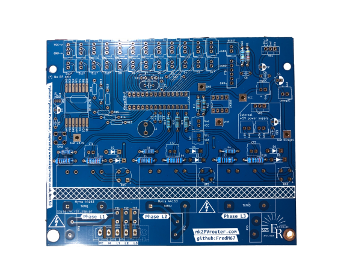
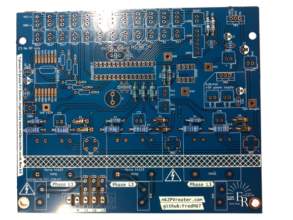
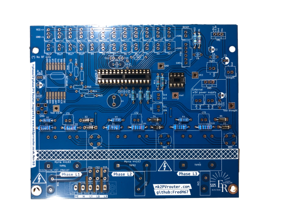
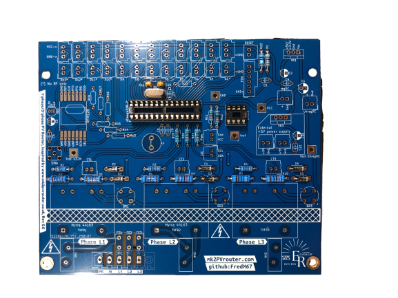
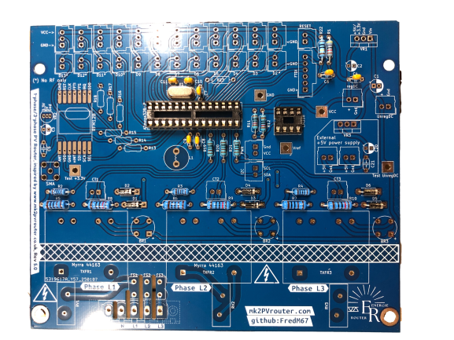
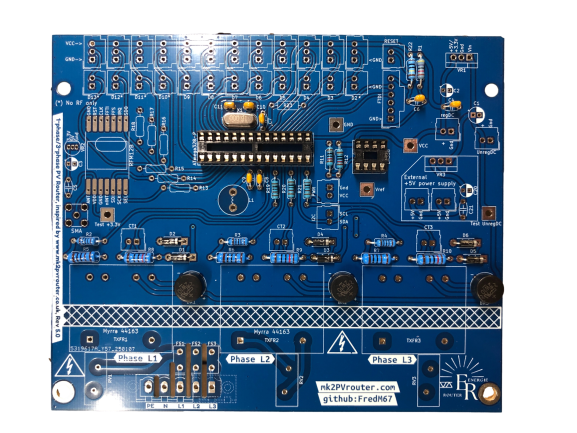
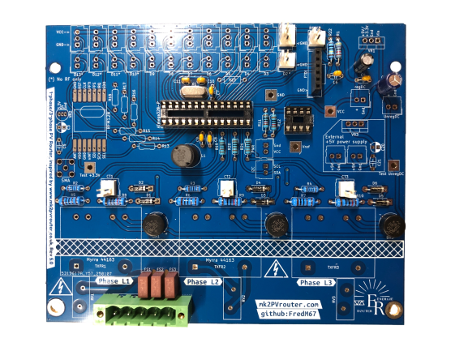
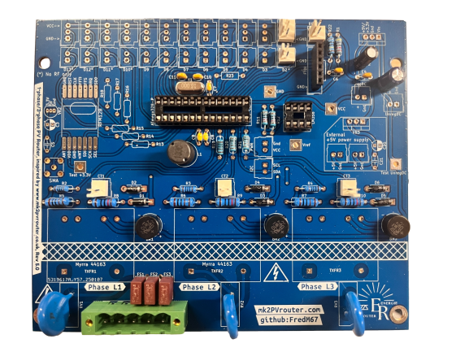
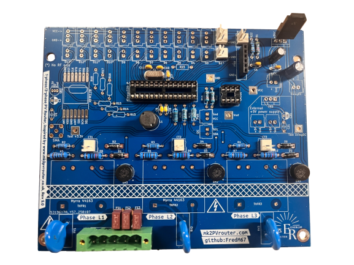
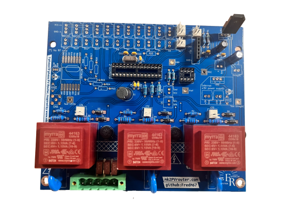

.. _carte-mere-tri-short:

Carte-mère triphasée
====================

.. contents:: Sommaire
   :local:
   :depth: 1

-------------

.. include:: ../common/ordre-soudure.inc.rst

-------------

Soudure des composants
----------------------

Résistances
~~~~~~~~~~~

   Carte-mère avec résistances soudées

Diodes
~~~~~~

   Carte-mère avec diodes soudées

Supports circuits intégrés
~~~~~~~~~~~~~~~~~~~~~~~~~~

   Carte-mère avec supports CI soudés

Condensateurs céramiques et oscillateur
~~~~~~~~~~~~~~~~~~~~~~~~~~~~~~~~~~~~~~~

   Carte-mère avec oscillateur et ses condensateurs associés soudés

   Carte-mère avec condensateurs céramiques soudés

Ponts redresseurs ou ponts de diodes
~~~~~~~~~~~~~~~~~~~~~~~~~~~~~~~~~~~~

   Carte-mère avec ponts redresseurs soudés

Fusibles
~~~~~~~~

!! Manque photo !!

Connecteur secteur
~~~~~~~~~~~~~~~~~~

!! Manque photo !!

Connecteurs SIL/Molex
~~~~~~~~~~~~~~~~~~~~~

!! Manque photo !!

Inductance
~~~~~~~~~~

!! Manque photo !!

Condensateurs électrolytiques
~~~~~~~~~~~~~~~~~~~~~~~~~~~~~

   Carte-mère avec condensateurs électrolytiques soudés

Varistances
~~~~~~~~~~~

   Carte-mère avec varistances soudées

Régulateur de tension
~~~~~~~~~~~~~~~~~~~~~

   Carte-mère avec régulateur de tension soudé

Transformateurs
~~~~~~~~~~~~~~~

   Carte-mère avec transformateurs soudés
